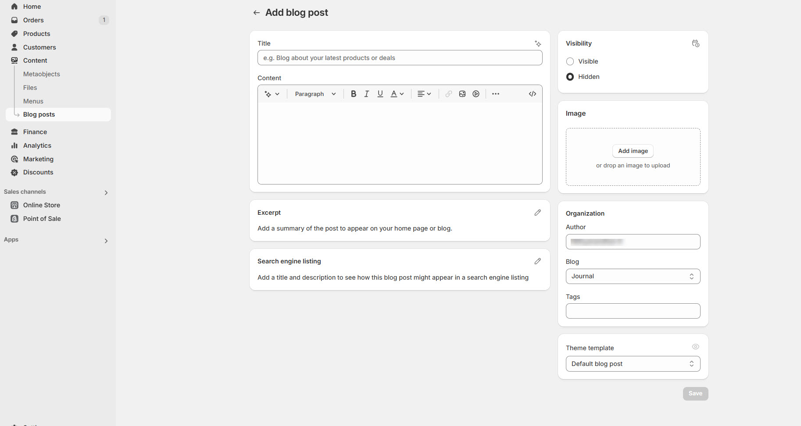

# Blogs

A blog in Shopify allows you to share news, updates, guides, and engaging content to **attract visitors, boost SEO, and enhance customer engagement**.

<figure><figcaption></figcaption></figure>

### **Step 1: Navigate to Blog Posts**

1. **Go to** Shopify Admin > **Online Store > Blog Posts**.
2. Click **Create Blog Post**.

### **Step 2: Enter Blog Post Details**

1. **Title:** Enter a blog title (e.g., **"Top 10 Trends of 2025"**).
2. **Content:** Add text, images, videos, or embedded content.
3. **Author:** Select or create an author name.
4. **Featured Image:** Upload a thumbnail image for the blog post.
5. **Visibility:** Choose **Visible** to publish immediately or **Hidden** to save as a draft.

### **Step 3: Assign the Blog to a Category**

1. Scroll to **Organization** and select a blog category.
   * Default is **"News"** (Create a new blog category if needed).
2. Click **Manage Blogs** to create and organize multiple blog categories.

### **Step 4: Customize SEO Settings (Optional)**

1. Click **Edit Website SEO**.
2. Add a **meta title, meta description, and URL handle** to improve search visibility.

### **Step 5: Save & Publish**

1. Click **Save** to store changes.
2. If ready, ensure the post is **Visible** and published on your store.

### **Step 6: Add the Blog to Navigation (Optional)**

1. **Go to** Shopify Admin > **Online Store > Navigation**.
2. Click **Main Menu** or **Footer Menu**.
3. Click **Add Menu Item**, enter **"Blog"**, and select your blog page.
4. Click **Save Menu** to make it accessible on your store.

### **Best Practices**

* Use **engaging titles** to attract readers.
* Include **high-quality images** to make content visually appealing.
* Optimize blog posts with **SEO-friendly keywords**.
* Share blog posts on **social media** to increase traffic.
