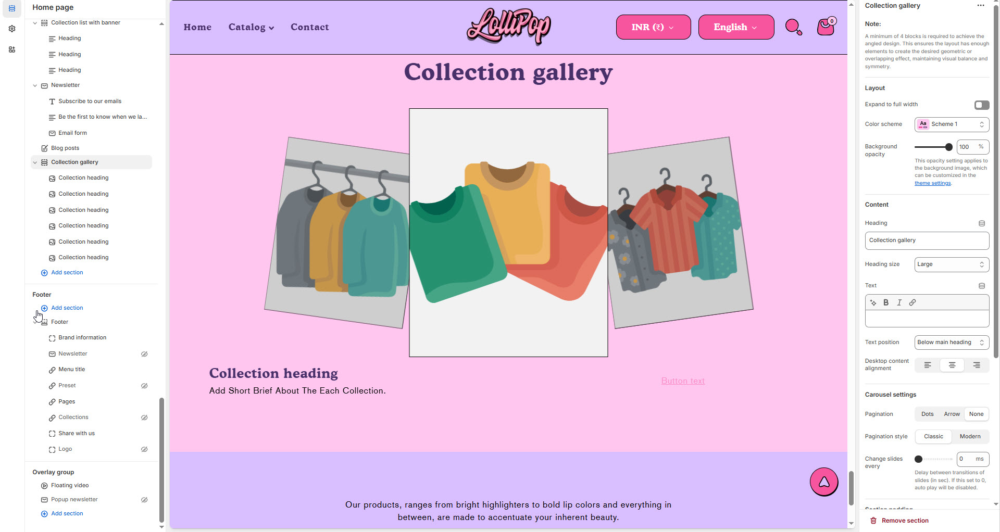

# Collection Gallery

The **Collection Gallery** section in Shopify is used to **showcase multiple product collections** (like "New Arrivals," "Best Sellers," or "Summer Sale") in a clean, grid-style layout — great for guiding customers to specific product categories.


1. **Go to** Shopify Admin > Online Store > Themes.
2. **Click** Customize on your live theme.
3. In the theme editor, **click** Add Section > **Collection gallery**


### **Settings & Customization**

<figure><figcaption></figcaption></figure>


**Note:**

A minimum of 4 blocks is required to achieve the angled design. This ensures the layout has enough elements to create the desired geometric or overlapping effect, maintaining visual balance and symmetry


#### **Layout**

* **Expand to Full Width** : Enable this option to extend the announcement bar across the entire screen width.
* **Color scheme:** You can customize the section’s appearance by changing the **text color, background color**, and more using **preset color** options.
* **Background Opacity** : Set the transparency level (Range: 0–100, Default: 100).\
  \&#xNAN;_This setting applies to the background image, which can be customized in the theme settings._

#### Content Settings

* **Heading:** Set a custom title (**e.g., "Hot & Top Trends"**).
* **Heading Size:** Choose from **Small, Medium, or Large** (**Default: Medium**).
* **Subheading:** Add additional text if needed.
* **Text Position :** Select the Position
  * **Above Main Heading** – Position the subheading above the main heading.
  * **Below main heading** – Position the subheading below the main heading.
* **Desktop Content Alignment** – Choose the text alignment for desktop. **( Left, Right & Center ).** The content alignment is automatically centered on mobile screens.

#### **Carousel Settings**

* **Enable Carousel** – Enable to display products in a sliding carousel format.
* **Pagination** – Choose the pagination type: **Dots** (dot indicators), **Arrow** (manual navigation), or **None** (no indicators).
* **Pagination Style** – Choose the style: **Classic** (traditional) or **Modern** (updated look).
* **Change Slides Every** – Set the transition delay (in seconds). _If set to 0, auto-play will be disabled._
* **Gap** – Define spacing between images (_Default: 30_). _The gap adjusts automatically on mobile screens._

#### Section padding

* **Top & Bottom Padding:** Adjust the spacing above and below the section for a well-structured layout.

#### **Shapes**

* **Shaper** – Adds shape effects to the section. Options: **Shaper Top, Shaper Bottom, Shaper Both, None, Border Top, Border Bottom, and Both Borders**.
* **Shaper Top Color** – Sets the top shape color (_choose your preferred color_).
* **Shaper Bottom Color** – Sets the bottom shape color (_choose your preferred color_).
