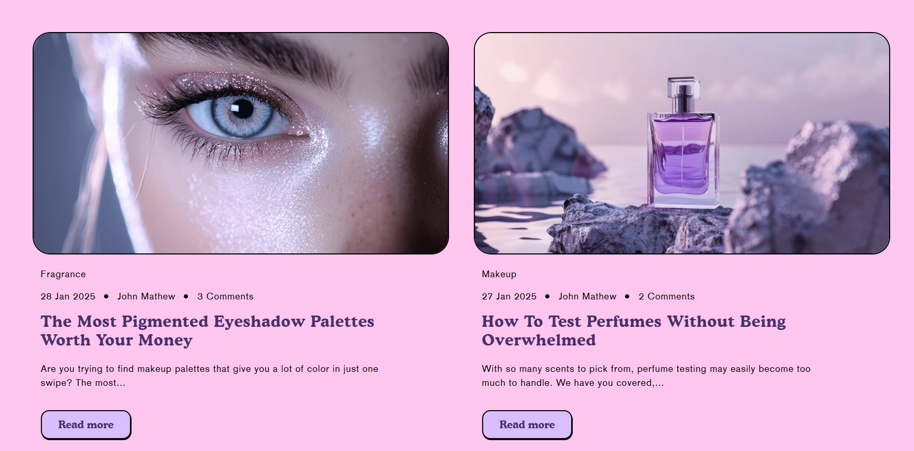
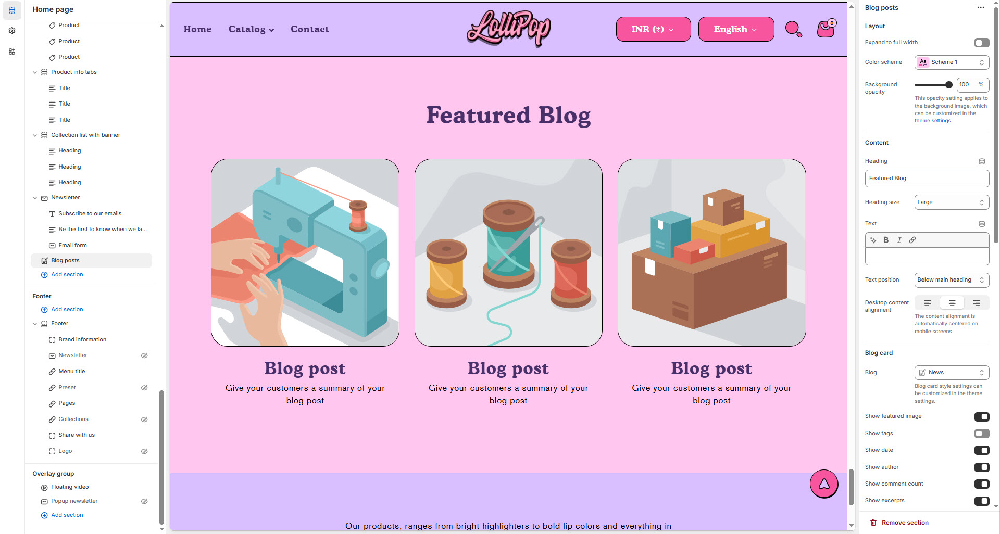

# Blog Posts

The **Blog Posts Section** allows you to display recent or featured blog posts on your Shopify store, helping to engage visitors and improve SEO. You can customize its layout, aspect ratio, text alignment, and enable features like author name, comments, and excerpts.


1. **Go to** Shopify Admin > **Online Store > Themes**.
2. Click **Customize** on your active theme.
3. In the Theme Editor, click **Add Section > Blog Posts**.


<figure><figcaption></figcaption></figure>

### **Settings & Customization**

<figure><figcaption></figcaption></figure>

#### **Blog Posts Settings**

**Layout**

* **Expand to Full Width** : Enable this option to extend the blog section across the entire screen width.
* **Color Scheme :** Customize the section’s appearance by changing the text color, background color, and more using preset color options.
* **Background Opacity :** Set the transparency level (Range: 0–100, Default: 100). This setting applies to the background image, which can be customized in the theme settings.

#### **Content Settings**

* **Heading** – Set a custom title (e.g., _"Featured Blog"_).
* **Heading Size** – Choose from Small, Medium, or Large (Default: Large).
* **Text** – Add optional supporting text.
* **Text Position** – Select the position:
  * **Above Main Heading** – Position the text above the heading.
  * **Below Main Heading** – Position the text below the heading (Default).
* **Desktop Content Alignment** – Choose the text alignment for desktop (Left, Right, or Center). The content alignment is automatically centered on mobile screens.

#### **Blog Card Settings**

* **Blog Category** – Choose the category to display (e.g., _Blog, News_).
* **Blog Card Style** – Customize the appearance of blog cards in the theme settings.
* **Show Featured Image** – Enable to display the blog’s featured image.
* **Show Tags** – Display category tags for each blog post.
* **Show Date** – Show the blog post’s published date.
* **Show Author** – Display the author’s name.
* **Show Comment Count** – Show the number of comments.
* **Show Excerpts** – Display a short summary of the blog post.
* **Show Read More** – Enable a “Read More” button for expanded content.

#### **Column Settings**

* **Blog Posts Visible** – Set the total number of blog posts displayed (Default: 3).
* **Desktop Columns** – Choose the number of columns for desktop view (Options: 2, 3, 4).
* **Mobile Columns** – The column option is automatically optimized to a single column on mobile screens.

#### **Carousel Settings**

* **Enable Carousel** – Enable to display blog posts in a sliding carousel format.
* **Change Slides Every** – Set the transition delay (in seconds). If set to `0`, auto-play will be disabled.
* **Gap** – Define spacing between images (Default: 20). The gap adjusts automatically on mobile screens.
* **Pagination** – Choose the pagination type: **Dots** (dot indicators), **Arrow** (manual navigation), or **None** (no indicators).
* **Pagination Style** – Choose the style: **Classic** (traditional) or **Modern** (updated look).\\

#### **Section Padding**

* **Top & Bottom Padding** – Adjust the spacing above and below the section for a well-structured layout.

#### **Shapes**

* **Shaper** – Adds shape effects to the section. Options: **Shaper Top, Shaper Bottom, Shaper Both, None, Border Top, Border Bottom, and Both Borders**.
* **Shaper Top Color** – Sets the top shape color (choose your preferred color).
* **Shaper Bottom Color** – Sets the bottom shape color (choose your preferred color).

####
