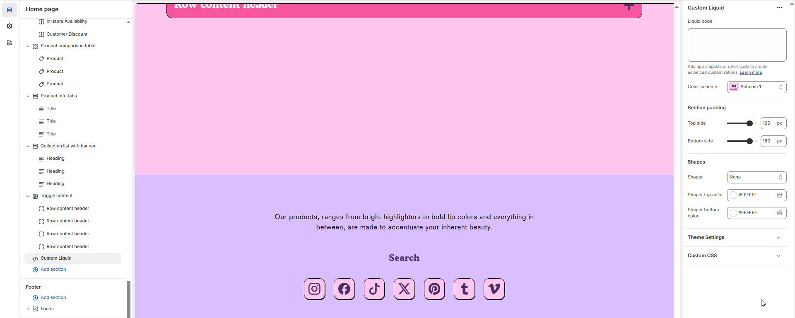

# Custom Liquid


1. Go to **Online Store > Themes > Customize**
2. Choose a page (or create a new one)
3. Click **Add Section** > **Custom Liquid**


#### **Custom Liquid**

The **Custom Liquid** section allows advanced users to inject their own Liquid code directly into the theme.

* This is ideal for adding unique design elements, custom functionality, or integrating third-party features.
* One of its biggest advantages is **preservation across theme updates**—custom Liquid code remains intact during migrations, making it a safe way for merchants to customize without disrupting the upgrade path.
* Perfect for small enhancements without developer intervention.

<figure><figcaption></figcaption></figure>

#### Settings & Customization

* **Liquid code :** Add app snippets or other code to create advanced customizations.
* **Color scheme:** You can customize the section’s appearance by changing the **text color, background color**, and more using **preset color** options.

#### **Spacing & Padding**

* **Top Margin:** Adjust the top margin of the footer. _(Default: 0px)_
* **Section Padding:** Customize spacing above and below the footer. _(Default: Top: 100px, Bottom: 100px)_

#### **Shapes**

* **Shaper:** Adds shape effects to the footer section. _(Options: None, Border Top, Border Bottom, Both Borders)_
* **Border Top:** Adds a top border to the footer for better visual separation.

#### **Customization**

* **Custom CSS:** Allows adding custom styles for further footer customization.
