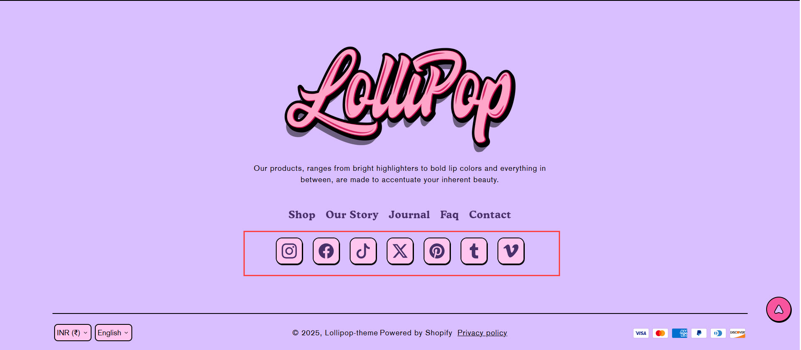
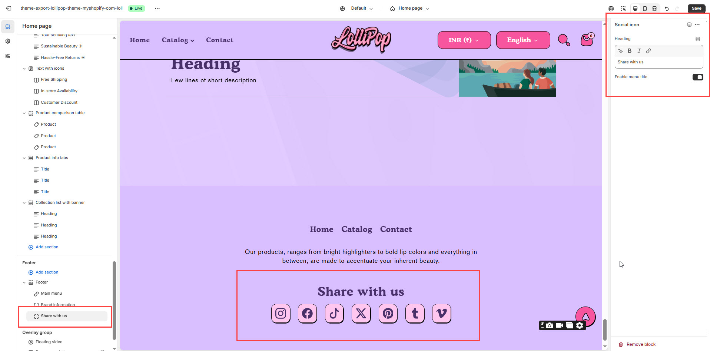

# Share with Us

The **Share with Us** section allows you to add social icons to your footer, making it easy for customers to connect with your brand on various platforms.


1. Go to **Online Store > Themes > Customize**.
2. Select the **Footer** section.
3. Click **Add block >** Share with Us
4. Enter **"Share with Us"** as the heading and add social media links.
5. Click **Save**.


<figure><figcaption></figcaption></figure>

### **Settings & Customization**

<figure><figcaption></figcaption></figure>

**Heading**

* **Heading:** Set a custom title for the social icon section. _(Example: "Share with us")_

**Display Options**

* **Enable Menu Title:** Toggle to show or hide the menu title.


You can **configure** social media links in the theme settings under[ Social Icon ](../../theme-settings/social-icon.md)options.

