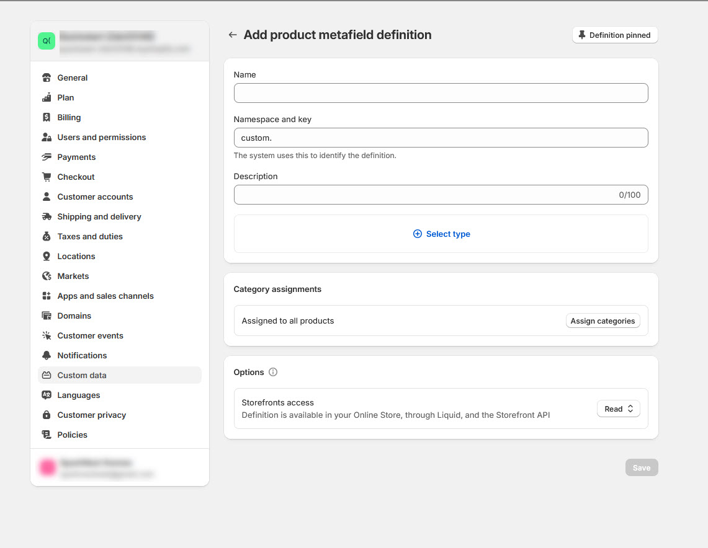

# Metafield

**Metafields**: Custom fields to store additional information about products, collections, customers, orders, etc.


1. **Go to Shopify Admin** : Navigate to **Settings** at the bottom left.
2. **Custom Data** : Select **Custom Data > Products > Add Definition**.
3. **Choose Object** : Add metafields for objects like **Products**, **Collections**, or **Orders**.
4. **Example** : To add metafields for products, click **Products** and define the custom fields.


### Steps to Create a New Metafield Definition: 

<figure><figcaption></figcaption></figure>


1. **Click “Add Definition”**: Navigate to **Settings > Custom Data** and click the **Add Definition** button.
2. **Define Metafield Properties**:
   * **Name**: Add a descriptive label for the metafield (e.g., "Material," "Ingredients").
   * **Namespace and Key**: Provide a unique identifier (e.g., `custom.material`).
   * **Content Type**: Select the data type (e.g., **Text**, **Number**, **File**, **Date**, **URL**).
     * **Example**: For "Material," choose **Text** or **Single Line Text**.
3. **Save**: Click **Save** to finalize the metafield definition.


### Steps to Create a New Metafield Definition: 


1. **Click “Add Definition”**: Navigate to **Settings > Custom Data** and click the **Add Definition** button.
2. **Define Metafield Properties**:
   * **Name**: Add a descriptive label for the metafield (e.g., "Material," "Ingredients").
   * **Namespace and Key**: Provide a unique identifier (e.g., `custom.material`).
   * **Content Type**: Select the data type (e.g., **Text**, **Number**, **File**, **Date**, **URL**).
     * **Example**: For "Material," choose **Text** or **Single Line Text**.
3. **Save**: Click **Save** to finalize the metafield definition.


<figure><figcaption></figcaption></figure>

### Adding and Using Metafields in Shopify 


* **Save the Metafield Definition**: After defining the metafield, ensure you click **Save** to store the new metafield definition.
* **Add Values to Metafields**:
  * **Navigate to the Object** : Go to the product, collection, customer, or other object in Shopify Admin where the metafield will be applied.
  * **Locate Metafields Section**: Scroll down to the **Metafields** section on the object page.
  * **Input Values**: Enter the appropriate value for the metafield.
    * **Example for Products** : If you created a metafield for "Material," enter **"Cotton"** as the value.
    * **Example for Customers** : For a "Size Preference" metafield, enter values like **"Medium"** or **"Large"**.
  * **Save Changes** : Click **Save** to apply the new value.


#### **Examples of Metafields**:

* **Product Metafield** – Namespace: custom, Key: material, Value: "Cotton"
* **Customer Metafield** – Namespace: preferences, Key: size\_preference, Value: "Large"
