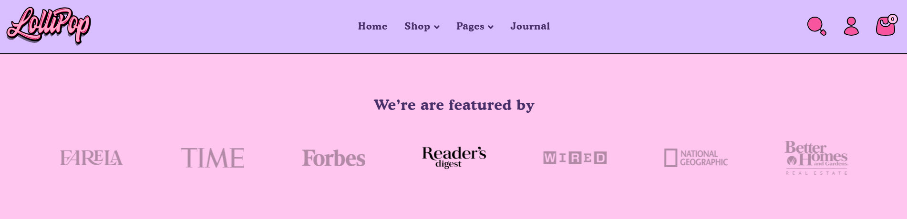
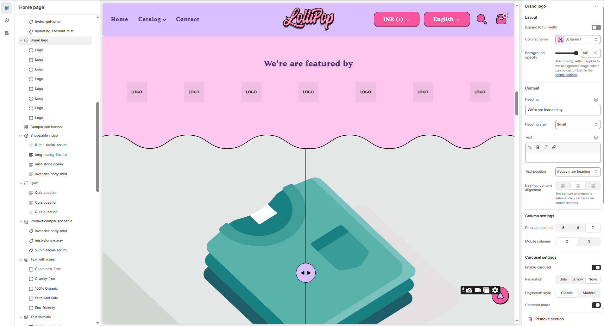
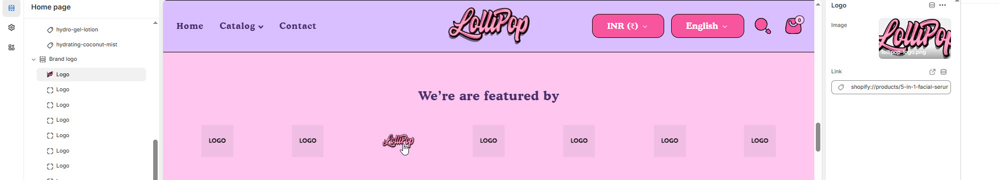

# Brand logo

The **Brand Logo** section allows you to display logos in a structured layout, enhancing brand recognition and credibility. This section is ideal for showcasing your own logo, trusted brands, media mentions, or partner collaborations.


1. **Go to Shopify Admin** > Online Store > Themes.
2. Click **Customize** on your active theme.
3. Click **Add Section** > **Brand Logo.**
4. Upload your logo or a collection of logos.
5. Adjust **size, spacing, and alignment** to fit your store’s layout.


<figure><figcaption></figcaption></figure>

### **Settings & Customization**

<figure><figcaption></figcaption></figure>

#### **Layout** 

* **Expand to Full Width:** Enable this option to extend the section across the entire screen width.
* **Color scheme:** You can customize the section’s appearance by changing the **text color, background color**, and more using **preset color** options.
* **Background Opacity:** Set the transparency level (Range: **0–100**, Default: **100**). This applies to the background image, which can be customized in the theme settings.

#### **Content Settings**

* **Heading:** Set a custom title (e.g., _"_&#x57;e’re are featured b&#x79;_"_).
* **Heading Size:** Choose from **Small, Medium, or Large** (Default: **Large**).
* **Text:** Add optional supporting text.
* **Text Position:**
  * **Above Main Heading** – Position the text above the heading.
  * **Below Main Heading** – Position the text below the heading (Default).
* **Desktop Content Alignment:** Choose from **Left, Right, or Center** (Automatically centered on mobile screens).

#### **Column Settings**

* **Maximum Logos to Show** – Set the total number of logos displayed. _(Default: 7)_
* **Desktop Columns** – Choose the number of columns for desktop view. _(Options: 5, 6, or 7)_
* **Mobile Columns** – Choose the number of columns for mobile view. _(Options: 2 or 3)_

#### **Carousel Settings** 

* **Enable Carousel** – Enable to display products in a sliding carousel format.
* **Pagination** – Choose the pagination type: **Dots** (dot indicators), **Arrow** (manual navigation), or **None** (no indicators).
* **Pagination Style** – Choose the style: **Classic** (traditional) or **Modern** (updated look).
* **Change Slides Every** – Set the transition delay (in seconds). _If set to 0, auto-play will be disabled._
* **Gap** – Define spacing between images (_Default: 30_). _The gap adjusts automatically on mobile screens._

#### Section padding 

* **Top & Bottom Padding:** Adjust the spacing above and below the section for a well-structured layout.

#### **Shapes** 

* **Shaper** – Adds shape effects to the section. Options: **Shaper Top, Shaper Bottom, Shaper Both, None, Border Top, Border Bottom, and Both Borders**.
* **Shaper Top Color** – Sets the top shape color (_choose your preferred color_).
* **Shaper Bottom Color** – Sets the bottom shape color (_choose your preferred color_).

<figure><figcaption></figcaption></figure>

#### **Logo Settings**

* **Image** – Upload an image for the logo.
* **Logo File** – Example: _lollipop-logo.png_
* **Link** – Add a link for the logo. _(e.g., shopify://products/facial-serum)_
