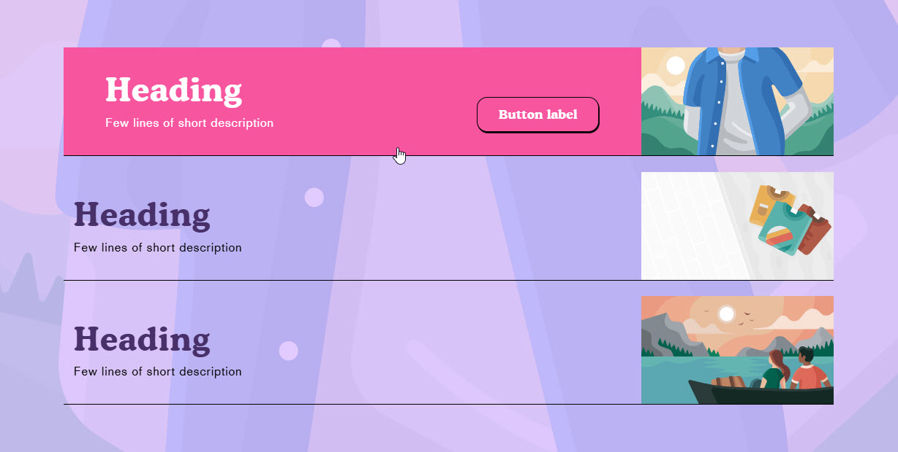
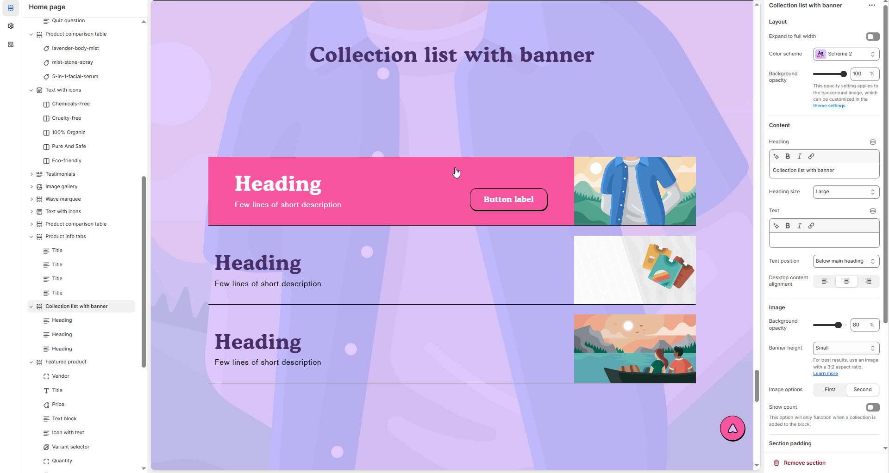
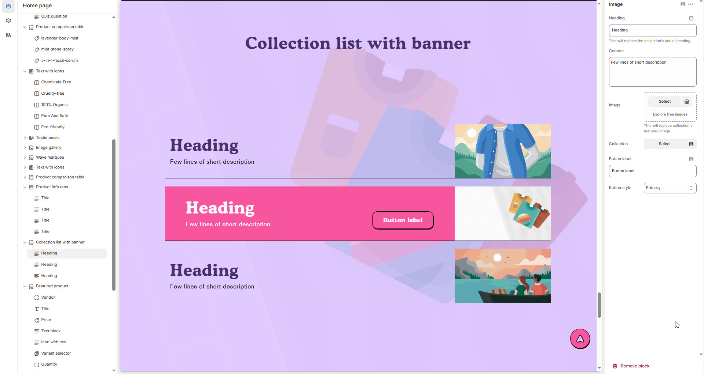

# Collection list with Banner

The **Collection List with Banner** section allows you to display multiple product collections with featured images and banners. This section is ideal for highlighting seasonal sales, new arrivals, or curated product categories in an engaging way.


1. **Go to Shopify Admin** > Online Store > Themes.
2. Click **Customize** on your active theme.
3. In the theme editor, click **Add Section** > **Collection List**.
4. Choose the collections you want to display.
5. Customize the **banner text, layout, and images** to match your store’s branding.


<figure><figcaption></figcaption></figure>

### **Settings & Customization**

<figure><figcaption></figcaption></figure>

#### **Layout Settings**

* **Expand to Full Width:** Enable this option to stretch the section across the entire screen width.
* **Color scheme :** You can customize the section’s appearance by changing the **text color, background color**, and more using preset color options.
* **Background Opacity:** Adjust the transparency level (Range: 0–100, Default: 100).
  * _This setting applies to the background image, which can be customized in the theme settings._

#### **Content Settings**

* **Heading:** Set a custom title (_e.g., "Collection List with Banner"_)
* **Heading Size:** Choose from _Small, Medium, or Large_ (Default: Large).
* **Text:** Add optional supporting text.
* **Text Position:**
  * _Above Main Heading – Position the subheading above the main heading._
  * _Below Main Heading – Position the subheading below the main heading (Default)._
* **Desktop Content Alignment:** Set text alignment for desktop (_Left, Center, or Right_).

#### **Image Settings**

* **Background Opacity:** Adjust transparency level (Range: 0–100, Default: 80).
* **Banner Height:** Choose from _Small, Medium, or Large_ (Default: Small).
  * _For best results, use an image with a 3:2 aspect ratio._
* **Image Options:** Select between _First or Second Image_.

#### **Collection Settings**

* **Show Count:** Display the number of products in the collection.
  * _This option only functions when a collection is added to the block._

#### **Section Padding**

* **Top Padding:** Adjust the spacing above the section (_Default: 100px_).
* **Bottom Padding:** Adjust the spacing below the section (_Default: 100px_).

#### **Shapes & Styling** 

* **Shaper:** Add visual elements (**None, Shaper Top, Shaper Bottom, Both, Borders**).
* **Shaper Top Color:** Customize the top shape color ( _choose your preferred color_).
* **Shaper Bottom Color:** Customize the bottom shape color ( _choose your preferred color_ ).

#### **Theme Customization** 

* **Custom CSS:** Add additional styling adjustments if needed.
* **Remove Section:** Option to delete this section from the page layout.

### **Collection List with Banner – Add Image**

<figure><figcaption></figcaption></figure>

**Image Settings**

* **Heading:** Customize the heading for this banner section.
  * _This will replace the collection’s actual heading._
* **Content:** Add a few lines of a short description.

**Image Upload**

* **Upload Image:** Select an image to replace the collection’s featured image.
* **Explore Free Images:** Browse from available free images.

**Collection Settings**

* **Collection:** Select the collection to be displayed in this block.

**Button Settings**

* **Button Label:** Customize the button text (_e.g., "Shop Now" or "View Collection"_).
* **Button Style:** Choose from predefined styles (_Primary, Secondary, or Custom_).
