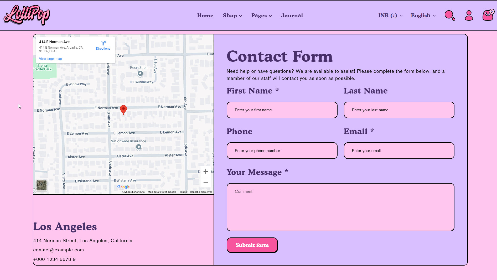
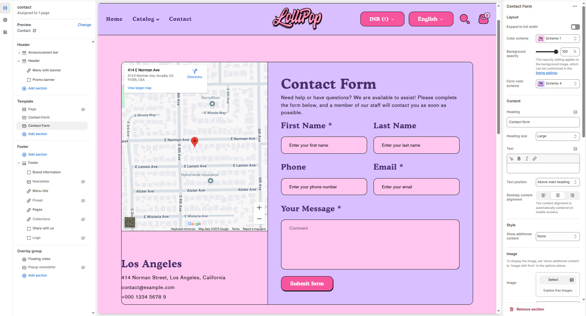

# Contact Form

The **Contact Form** allows customers to reach out to you directly from your website. It's commonly used for support, inquiries, or custom order requests.


1. **Go to Shopify Admin** > Online Store > Themes.
2. Click **Customize** on your active theme.
3. Click **Add Section** > Contact Form


<figure><figcaption></figcaption></figure>

### **Settings & Customization**

<figure><figcaption></figcaption></figure>

#### **Layout** 

* **Expand to Full Width:** Enable this option to extend the section across the entire screen width.
* **Color scheme:** You can customize the section’s appearance by changing the **text color, background color**, and more using **preset color** options.
* **Background Opacity:** Set the transparency level (Range: **0–100**, Default: **100**). This applies to the background image, which can be customized in the theme settings.

#### Content Settings 

* **Heading:** Set a custom title (**e.g., "**&#x43;ontact for&#x6D;**"**).
* **Heading Size:** Choose from **Small, Medium, or Large** (**Default: Medium**).
* **Subheading:** Add additional text if needed.
* **Text Position :** Select the Position
  * **Above Main Heading** – Position the subheading above the main heading.
  * **Below main heading** – Position the subheading below the main heading.
* **Desktop Content Alignment** – Choose the text alignment for desktop. **( Left, Right & Center ).** The content alignment is automatically centered on mobile screens.

#### Style

* **Show additional content :** You can customize the section’s **Map with form, Image with form and None**

#### **Image Settings** _(Only visible when “Image with form” is selected)_

* **Upload Image**: Upload a custom image to display beside the form.
* **Image Height**: Select how the image should scale — options include **Adapt**, **Small**, or **Tall**.
* **Desktop Layout**: Decide the layout order — for example, **Image Second** means the form appears first on desktop.

#### **Map Settings** _(Visible when “Map with form” is selected)_

* The map area appears beside or below the form, depending on the layout. Use a plugin or embed custom code if needed.

#### **Contact Information** _(Visible only when image or map is shown)_

* **Enable Information**: Toggle to show business details.
* **Address**: Enter your full business address.
* **Email**: Provide a valid support or contact email.
* **Phone**: Include a phone number for customer assistance.

#### Section padding 

* **Top & Bottom Padding:** Adjust the spacing above and below the section for a well-structured layout.

#### **Shapes** 

* **Shaper** – Adds shape effects to the section. Options: **Shaper Top, Shaper Bottom, Shaper Both, None, Border Top, Border Bottom, and Both Borders**.
* **Shaper Top Color** – Sets the top shape color (_choose your preferred color_).
* **Shaper Bottom Color** – Sets the bottom shape color ( &#x63;_&#x68;oose your preferred color_).
