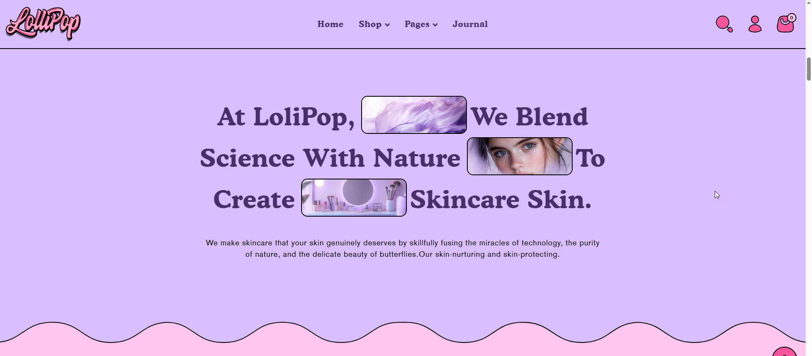
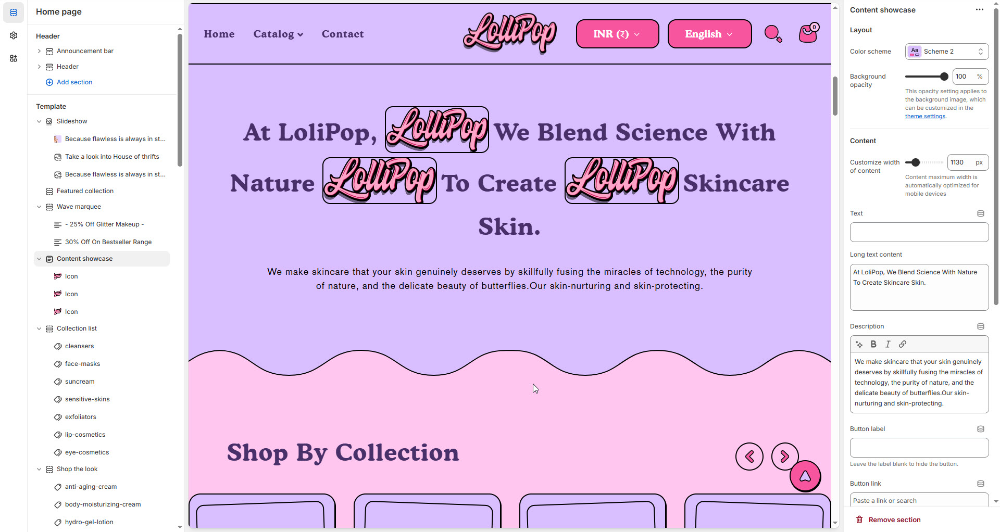
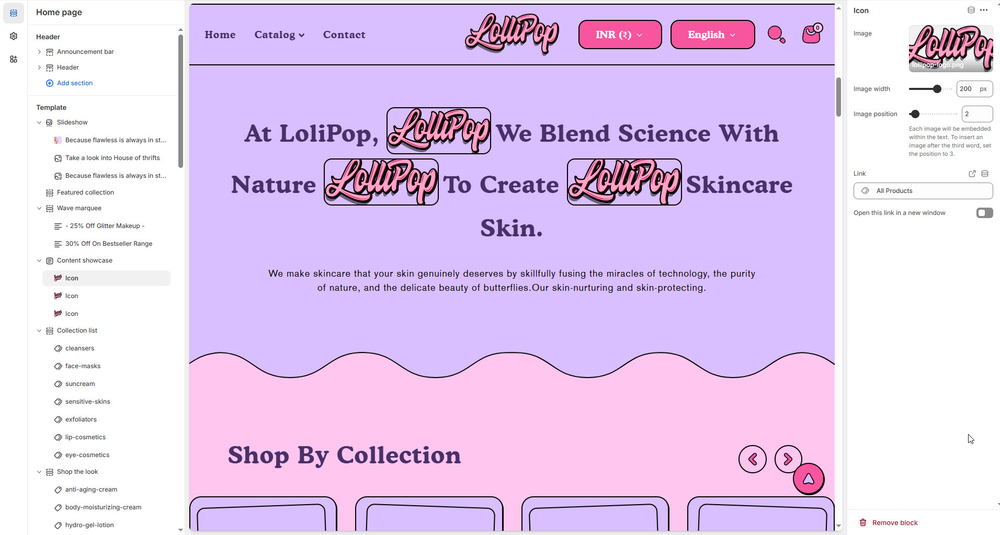

# Content showcase

The **Content Showcase Section** allows you to display featured or selected products in a visually appealing way. It is ideal for highlighting **specific collections, best-sellers, new arrivals, or seasonal promotions** to enhance customer engagement.


1. **Navigate to** Shopify Admin > Online Store > Themes.
2. **Click** Customize on your active theme.
3. **In the Theme Editor**, click **Add Section > Content Showcase**.


<figure><figcaption></figcaption></figure>

### **Settings & Customization**

#### Layout

* **Color scheme:** You can customize the section’s appearance by changing the **text color, background color**, and more using **preset color** options.
* **Background Opacity** : Set the transparency level (Range: 0–100, Default: 100).\
  \&#xNAN;_This setting applies to the background image, which can be customized in the theme settings._

<figure><figcaption></figcaption></figure>

#### **Content**

* **Customize Width of Content:** You can set the content width (e.g., _1130px_). It is automatically optimized for mobile devices.
* **Text:** Set a custom title (e.g., _"Heading"_).
* **Long Text Content:** Main content of the Content Showcase.
* **Description:** Customize the Content Showcase description.
* **Button Label:** Add text for the button (e.g., _"Shop Now"_).
* **Button Link:** Set the URL destination.
* **Button Style:** Choose the button style (_Primary, Secondary, or Hyperlink_).
* **Desktop Content Alignment:** Choose the text alignment for desktops (_Left, Right, or Center_). The content is automatically centered on mobile screens.

#### Section padding

* **Top & Bottom Padding:** Adjust the spacing above and below the section for a well-structured layout.

#### **Shapes**

* **Shaper** – Adds shape effects to the section. Options: **Shaper Top, Shaper Bottom, Shaper Both, None, Border Top, Border Bottom, and Both Borders**.
* **Shaper Bottom** – Displays a shape at the bottom.
* **Shaper Top Color** – Sets the top shape color (_choose your preferred color_).
* **Shaper Bottom Color** – Sets the bottom shape color (_choose your preferred color_).


click **Content Showcase Section > Add Icon**


<figure><figcaption></figcaption></figure>

#### **Icon**

* **Image:** Upload a custom image or select from free images.
* **Image Width:** Set the image width (e.g., _250px_).
* **Image Position:** Define the placement of the image within the text. (For example, setting the position to _3_ places the image after the third word).
* **Link:** Assign a destination link (e.g., _All Products_).
* **Open Link in a New Window:** Enable this option to open the link in a new tab.

**Theme Settings & Customization**

* Adjust additional styles in **Theme Settings**.
* Use **Custom CSS** for further design modifications.
