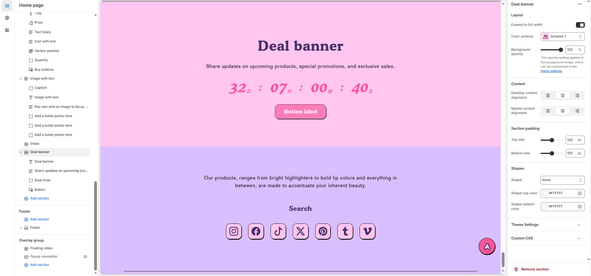

# Deal Banner

The **Deal Banner Section** allows you to create an eye-catching promotional banner with a countdown timer to highlight special deals, limited-time offers, or exclusive sales.


1. **Go to** Shopify Admin > **Online Store > Themes**.
2. Click **Customize** on your active theme.
3. In the Theme Editor, click **Add Section > Deal Banner**.


<figure><figcaption></figcaption></figure>

### **Settings & Customization**

<figure><figcaption></figcaption></figure>

#### **Layout** 

* **Expand to Full Width:** Enable this option to extend the section across the entire screen width.
* **Color scheme:** You can customize the section’s appearance by changing the **text color, background color**, and more using **preset color** options.
* **Background Opacity:** Set the transparency level (Range: **0–100**, Default: **100**). This applies to the background image, which can be customized in the theme settings.

#### **Content Settings**

* **Desktop Content Alignment:** Choose from **Left, Right, or Center**.
* **Mobile Content Alignment:** Choose from **Left, Right, or Center**.

#### **Section Padding** 

* **Top & Bottom Padding:** Customize the spacing for better section structure.

#### **Shapes** 

* **Shaper** – Adds shape effects to the section. Options: **Shaper Top, Shaper Bottom, Shaper Both, None, Border Top, Border Bottom, and Both Borders**.
* **Shaper Bottom** – Displays a shape at the bottom.
* **Shaper Top Color** – Sets the top shape color (_choose your preferred color_).
* **Shaper Bottom Color** – Sets the bottom shape color (_choose your preferred color_).

#### **Theme Settings & Customization** 

* Adjust additional styles in **Theme Settings**.
* Use **Custom CSS** for further design modifications.

### Deal timer

* **Select Date:** Choose the deal’s end date (**Format: 25 May 2025**).

**Counter Content**

* **Heading:** Add a custom heading for the deal banner (**e.g., "Limited Time Offer"**).
* **Text:** Provide a short description (**e.g., "Use this text to describe the deal countdown"**).

**Button Settings**

* **Button Label:** Customize the button text (**e.g., "Shop Now"**).
* **Button Link:** Paste or search for a destination URL.
* **Make Outline Button Style:** Enable to display the button with an outlined border instead of a filled style.
