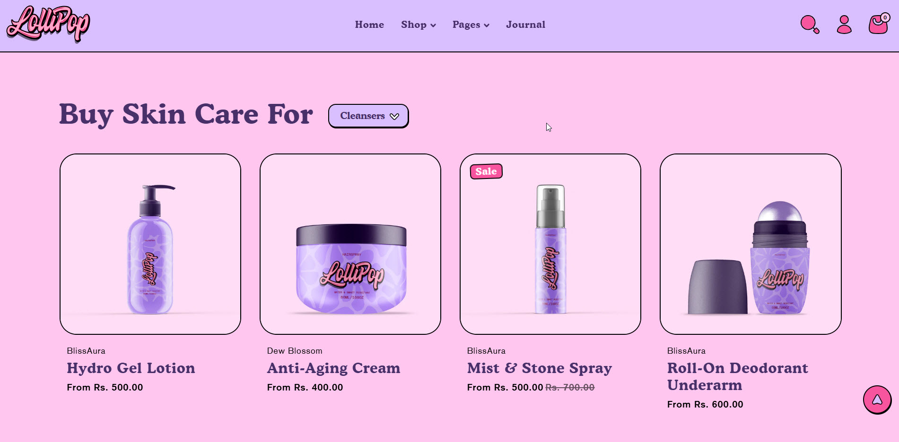
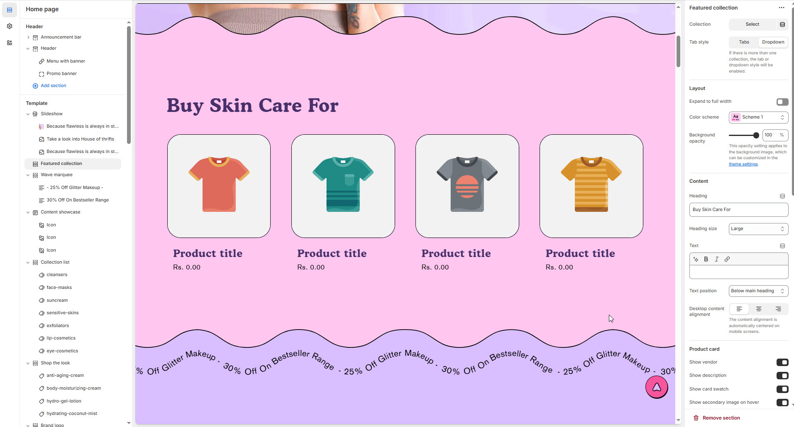
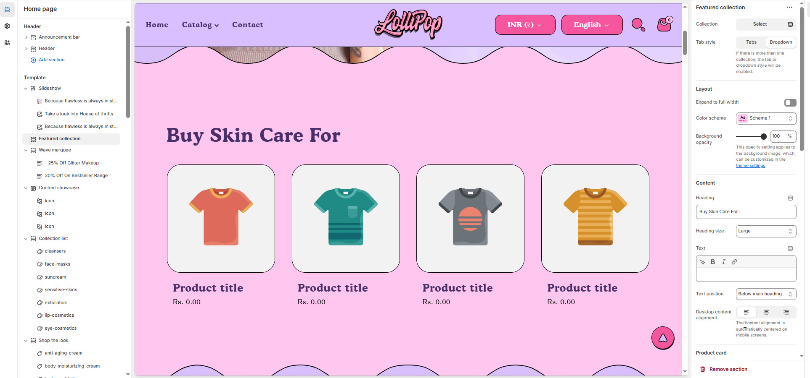

# Featured collection

The **Featured Collections** section highlights specific product collections on your store’s homepage or other pages, making it easier for customers to explore key categories.


1. **Go to** Shopify **Admin > Online Store > Themes.**
2. **Click** Customize on your live theme.
3. In the theme editor, **click** **Add Section > Featured Collections.**


<figure><figcaption></figcaption></figure>

### **Customize the Featured Collections Section**

<figure><figcaption></figcaption></figure>

* **Collection :** Choose a collection to display in the featured section ( [Creating Collection](https://help.shopify.com/en/manual/products/collections/manual-shopify-collection) ).
* **Tab Style :** You can choose the tab style for displaying collections:
  * **Tabs** – Displays collections in a tabbed format.
  * **Dropdown** – Displays collections in a dropdown menu.


**Note:** If there is more than one collection, either the tab or dropdown style will be enabled automatically


#### Layout

* **Expand to full width** : Enable this option to extend the announcement bar across the entire screen width.
* **Color scheme:** You can customize the section’s appearance by changing the **text color, background color**, and more using **preset color** options.
* **Background Opacity** : Set the transparency level (Range: 0–100, Default: 100).\
  \&#xNAN;_This setting applies to the background image, which can be customized in the theme settings._

<figure><figcaption></figcaption></figure>

#### Content Settings

* **Heading:** Set a custom title (**e.g., "Hot & Top Trends"**).
* **Heading Size:** Choose from **Small, Medium, or Large** (**Default: Medium**).
* **Subheading:** Add additional text if needed.
* **Text Position :** Select the Position
  * **Above Main Heading** – Position the subheading above the main heading.
  * **Below main heading** – Position the subheading below the main heading.
* **Desktop Content Alignment** – Choose the text alignment for desktop. **( Left, Right & Center )**
* The content alignment is automatically centered on mobile screens.

#### **Product Card Settings**

* **Show Vendor** – Display the product vendor/brand.
* **Show Description** – Enable to show product descriptions.
* **Show Card Swatch** – Display product swatches (e.g., colors or patterns).
* **Show Secondary Image on Hover** – Show an alternate image when hovering over a product.
* **Show Quick Add Option** – Enable a quick add-to-cart button.
* **Content Alignment** – Choose the text alignment for desktop. **( Left, Right & Center )**
* **Aspect ratio -** There are 3 option image ratio as **( Adapt to image, square, and portrait) .**&#x43;an choose the required style as theme requirement

#### **Column Settings**

* **Maximum Products to Show** – Set the total number of products displayed. _(Default: 7)_
* **Desktop Columns** – Choose the number of columns for desktop view. _(Options: 3, 4, 5, 6)_
* **Mobile Columns** – Choose the number of columns for mobile view. _(Options: 1, 2)_

#### **Carousel Settings**

* **Enable Carousel** – Enable to display products in a sliding carousel format.
* **Change Slides Every** – Set the delay between transitions in seconds (_Default: 0 – Auto-play disabled_).
* **Gap** – Set spacing between product cards (_Default: 55px_).
  * _Note:_ This option is applicable only when the card style is set to classic.
* **Pagination** – Choose the pagination type: **Dots** (dot indicators), **Arrow** (manual navigation), or **None** (no indicators).
* **Pagination Style** – Choose the style: **Classic** (traditional) or **Modern** (updated look).

#### Section padding

* **Top & Bottom Padding:** Adjust the spacing above and below the section for a well-structured layout.

#### **Shapes**

* **Shaper** – Adds shape effects to the section. Options: **Shaper Top, Shaper Bottom, Shaper Both, None, Border Top, Border Bottom, and Both Borders**.
* **Shaper Top Color** – Sets the top shape color (_choose your preferred color_).
* **Shaper Bottom Color** – Sets the bottom shape color (_choose your preferred color_).

**Theme Settings & Customization**

* Adjust additional styles in **Theme Settings**.
* Use **Custom CSS** for further design modifications.
