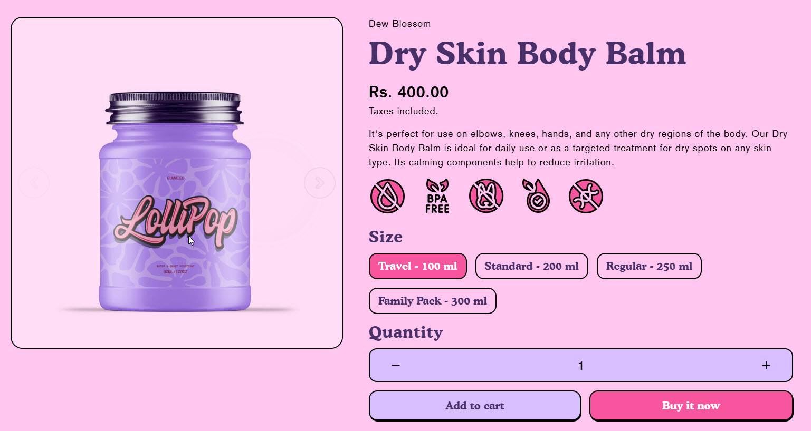
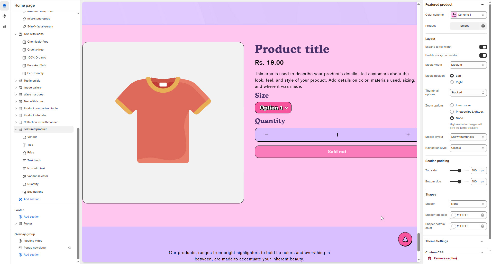

# Featured Products

The **Featured Products Section** allows you to highlight selected products on your homepage or other pages. This section is ideal for showcasing **best-sellers, new arrivals, or promotional items**, helping customers easily discover key products.


1. **Go to** Shopify Admin > Online Store > Themes.
2. **Click** Customize on your active theme.
3. In the theme editor, **click** Add Section > Featured Products.


<figure><figcaption></figcaption></figure>

### **Settings & Customization**

<figure><figcaption></figcaption></figure>

**Color scheme :** You can customize the section’s appearance by changing the **text color, background color**, and more using preset color options.

**Select Product:** Choose the product to be featured.

#### **Layout Settings**

* **Expand to Full Width:** Enable this option to extend the section across the entire screen width.
* **Enable Sticky on Desktop:** Keep the product section fixed while scrolling.
* **Media Width:** Choose from _Small, Medium, or Large_ (Default: Medium).
* **Media Position:** Set image placement to _Left or Right_.
* **Thumbnail Layout:** Choose _Horizontal, Stacked or Vertical_ arrangement.
* **Zoom Options:**
  * _Inner Zoom_ – Enables zoom effect on hover.
  * _Photoswipe Lightbox_ – Opens the image in a lightbox.
  * _None_ – Disables zoom functionality.
* _High-resolution images are recommended for better visibility._
* **Mobile Layout :** Enable to remove thumbnails for a cleaner mobile experience.
* **Navigation Style:** Select _Classic or Modern_ for the navigation UI.

#### **Section Padding** 

* **Top Padding:** Adjust spacing above the section (**Default: 0px**).
* **Bottom Padding:** Adjust spacing below the section (**Default: 160px**).

#### **Shapes & Styling** 

* **Shaper:** Add visual elements (**None, Shaper Top, Shaper Bottom, Both, Borders**).
* **Shaper Top Color:** Customize the top shape color ( _choose your preferred color_).
* **Shaper Bottom Color:** Customize the bottom shape color ( _choose your preferred color_ ).

#### **Theme Customization** 

* **Custom CSS:** Add additional styling adjustments if needed.
* **Remove Section:** Option to delete this section from the page layout.
