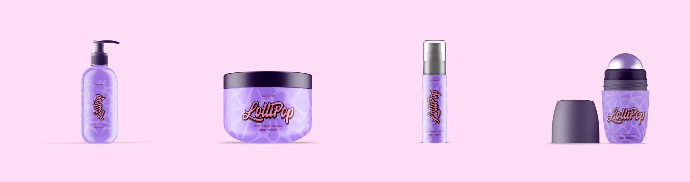
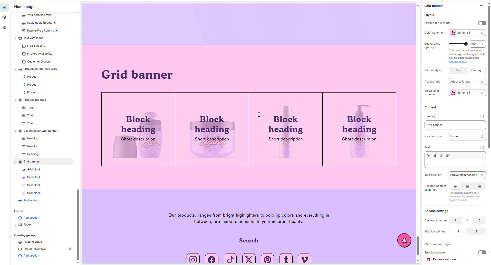
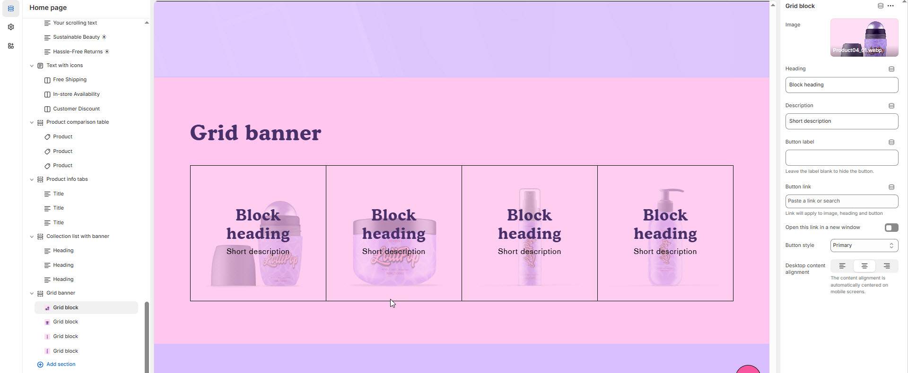

# Grid Banner

he **Grid Banner Section** allows you to create a **grid layout** of cards featuring **background images, and text**. This section is useful for highlighting **categories, promotions, or featured content** in an engaging and structured format.


1. **Go to** Shopify Admin > **Online Store > Themes**.
2. Click **Customize** on your active theme.
3. In the Theme Editor, click **Add Section > Grid Banner**


<figure><figcaption></figcaption></figure>

### **Settings & Customization**

<figure><figcaption></figcaption></figure>

#### **Layout** 

* **Expand to Full Width:** Enable this option to extend the section across the entire screen width.
* **Color scheme:** You can customize the section’s appearance by changing the **text color, background color**, and more using **preset color** options.
* **Background Opacity:** Set the transparency level (Range: **0–100**, Default: **100**). This applies to the background image, which can be customized in the theme settings.
* **Banner Style**: Choose between **Grid or Overlay**
* **Aspect Ratio:** Choose how the image scales **Square, Portrait, or Adapt to image** .
* **Block color scheme :** You can customize the section’s appearance by changing the **text color, background color**, and more using **preset color** options.

#### **Content Settings**

* **Heading:** Set a custom title (_e.g., "Collection List with Banner"_)
* **Heading Size:** Choose from _Small, Medium, or Large_ (Default: Large).
* **Text:** Add optional supporting text.
* **Text Position:**
  * _Above Main Heading – Position the subheading above the main heading._
  * _Below Main Heading – Position the subheading below the main heading (Default)._
* **Desktop Content Alignment:** Set text alignment for desktop (_Left, Center, or Right_).

#### **Column Settings**

* **Desktop Columns** – Choose the number of columns for desktop view. _(Options: 3, 4, and 5)_
* **Mobile Columns** – Choose the number of columns for mobile view. _(Options: 1, 2)_

#### **Carousel Settings** 

* **Enable Carousel** – Enable to display products in a sliding carousel format.
* **Change Slides Every**: Set slide transition delay (in seconds). 0 disables auto-play.
* **Gap** – Define spacing between images (_Default: 30_). _The gap adjusts automatically on mobile screens._
* **Pagination** – Choose the pagination type: **Dots** (dot indicators), **Arrow** (manual navigation), or **None** (no indicators).
* **Pagination Style** – Choose the style: **Classic** (traditional) or **Modern** (updated look).
* **Change Slides Every** – Set the transition delay (in seconds). _If set to 0, auto-play will be disabled._

#### Section padding 

* **Top & Bottom Padding:** Adjust the spacing above and below the section for a well-structured layout.

#### **Shapes** 

* **Shaper** – Adds shape effects to the section. Options: **Shaper Top, Shaper Bottom, Shaper Both, None, Border Top, Border Bottom, and Both Borders**.
* **Shaper Top Color** – Sets the top shape color (_choose your preferred color_).
* **Shaper Bottom Color** – Sets the bottom shape color (_choose your preferred color_).

<figure><figcaption></figcaption></figure>

### **Grid Block Settings**

* **Image**: Upload an image (**Recommended format: .webp, .jpg, .png**).
* **Heading**: Enter the block heading (e.g., "Block Heading").
* **Description**: Add a short description.
* **Button Label**: Leave blank to hide the button.
* **Button Link**: Paste a link or search for a page.
  * The link applies to the **image, heading, and button**.
* **Open Link in a New Window**: Enable if needed.
* **Button Style**: Choose Primary for the main call-to-action button.
* **Desktop Content Alignment:** Set text alignment for desktop (_Left, Center, or Right_). (automatically centered on mobile screens).
