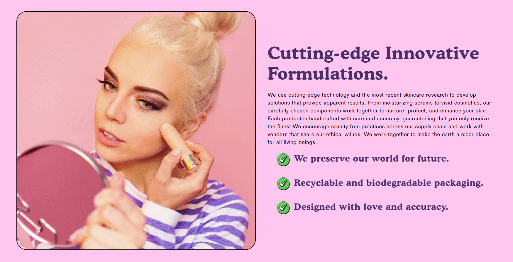
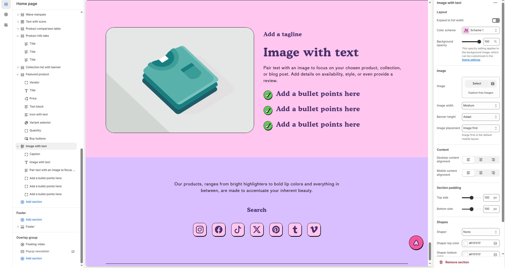

# Image with Text

The **Image with Text** section allows you to display an image alongside text, creating a visually appealing layout that enhances storytelling, promotions, or brand messaging.


1. **Go to** Shopify Admin > **Online Store > Themes**.
2. Click **Customize** on your active theme.
3. In the Theme Editor, click **Add Section > Image with Text**.


<figure><figcaption></figcaption></figure>

### **Settings & Customization**

<figure><figcaption></figcaption></figure>

#### **Layout Settings**

* **Expand to Full Width:** Enable this option to stretch the section across the entire screen width.
* **Color scheme :** You can customize the section’s appearance by changing the **text color, background color**, and more using preset color options.
* **Background Opacity:** Adjust the transparency level (Range: 0–100, Default: 100).
  * _This setting applies to the background image, which can be customized in the theme settings._

#### **Image Settings**

* **Upload Image:** Select an image or explore free images.
* **Image Width:** Choose from _Small, Medium, or Large_ (Default: Medium).
* **Banner Height:** Set the banner height to _Adapt, Small, Medium, or Large_ (Default: Adapt).
* **Image Placement:** Choose _Image First or Image Last_ (Default: Image First).
  * _Image First is the default mobile layout._

#### **Content Alignment**

* **Desktop Content Alignment:** Set text alignment for desktop (_Left, Center, or Right_).
* **Mobile Content Alignment:** Set text alignment for mobile (_Automatically optimized for responsiveness_).

#### **Section Padding**

* **Top Padding:** Adjust the spacing above the section (_Default: 100px_).
* **Bottom Padding:** Adjust the spacing below the section (_Default: 100px_).

#### **Shapes & Styling** 

* **Shaper:** Add visual elements (**None, Shaper Top, Shaper Bottom, Both, Borders**).
* **Shaper Top Color:** Customize the top shape color ( _choose your preferred color_).
* **Shaper Bottom Color:** Customize the bottom shape color ( _choose your preferred color_ ).

#### **Theme Customization** 

* **Custom CSS:** Add additional styling adjustments if needed.
* **Remove Section:** Option to delete this section from the page layout.
