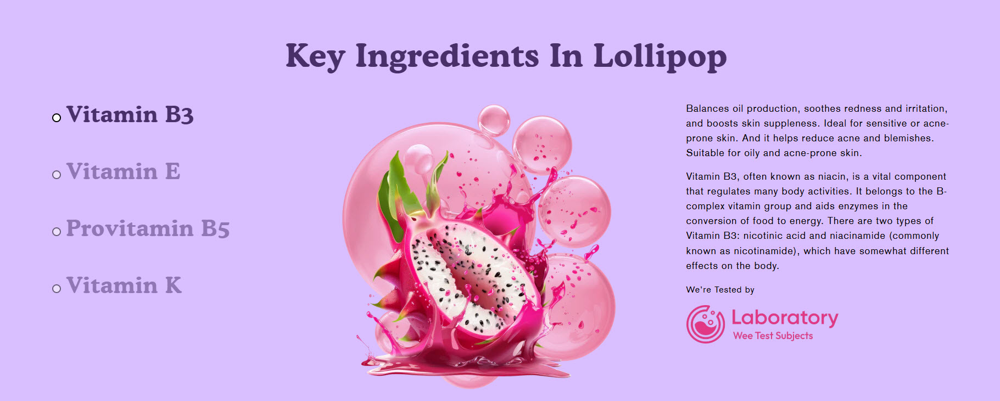
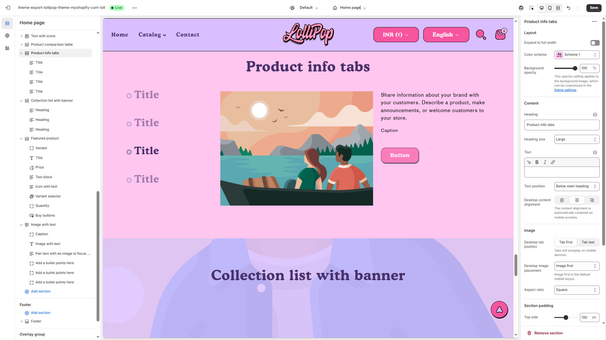
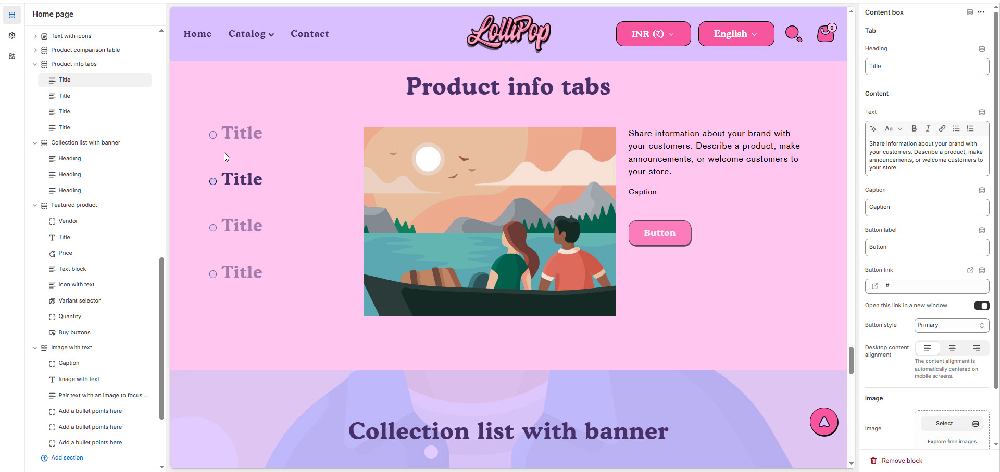

# Product info tabs

The **Product Info Tabs** feature helps organize detailed product information into collapsible or clickable tabs, making it easier for customers to browse key details without scrolling through long descriptions.


1. **Go to Shopify Admin** > Online Store > Themes.
2. Click **Customize** on your active theme.
3. Select the **Product Page** from the theme editor.
4. Click **Add Section** > **Product Info Tabs** (if available in your theme).
5. Customize the tabs by adding relevant content like **Description, Shipping Info, Reviews, FAQs, or Size Charts**.


<figure><figcaption></figcaption></figure>

### **Settings & Customization**

<figure><figcaption></figcaption></figure>

#### **Layout Settings**

* **Expand to Full Width:** Enable this option to stretch the section across the entire screen width.
* **Color scheme :** You can customize the section’s appearance by changing the **text color, background color**, and more using preset color options.
* **Background Opacity:** Adjust the transparency level (Range: 0–100, Default: 100).
  * _This setting applies to the background image, which can be customized in the theme settings._

#### **Content Settings**

* **Heading:** Set a custom title (_e.g., "Collection List with Banner"_)
* **Heading Size:** Choose from _Small, Medium, or Large_ (Default: Large).
* **Text:** Add optional supporting text.
* **Text Position:**
  * _Above Main Heading – Position the subheading above the main heading._
  * _Below Main Heading – Position the subheading below the main heading (Default)._
* **Desktop Content Alignment:** Set text alignment for desktop (_Left, Center, or Right_).

#### **Image & Tab Settings**

* **Desktop Tab Position**: Choose _Tab First_ (tabs appear before the image) or _Tab Last_ (tabs appear after the image). Tabs autoplay on mobile devices.
* **Desktop Image Placement:** Options: **Image First** and **Image second** (default for mobile layout).
* **Aspect Ratio:** Choose how the image scales **Square, Portrait, or Adapt to image** .

#### **Section Padding** 

* **Top Padding:** Adjust spacing above the section (**Default: 120px**).
* **Bottom Padding:** Adjust spacing below the section (**Default: 132px**).

#### **Shapes & Styling** 

* **Shaper:** Add visual elements (**None, Shaper Top, Shaper Bottom, Both, Borders**).
* **Shaper Top Color:** Customize the top shape color (_choose your preferred color_).
* **Shaper Bottom Color:** Customize the bottom shape color (_choose your preferred color_).

#### **Theme Customization** 

* **Custom CSS:** Add additional styling adjustments if needed.
* **Remove Section:** Option to delete this section from the page layout.


**Product Info Tabs > Add Content Box**


<figure><figcaption></figcaption></figure>

### **Content Box Settings**

* **Tab Heading:** Set a custom title for the tab (e.g., _"Key Ingredients"_).
* **Tab Content:** Provide details about the product, brand, or special announcements.
* **Caption:** Add a short, descriptive caption.
* **Button Settings:**
  * **Button Label:** Define button text (e.g., _"Learn More"_).
  * **Button Link:** Enter a URL (**Default: #**).
  * **Open in a New Window:** _Enable or disable this option._
  * **Button Style:** Choose between **Primary** or **Secondary**.
* **Desktop Content Alignment:** Set text alignment for desktop (_Left, Center, or Right_).
