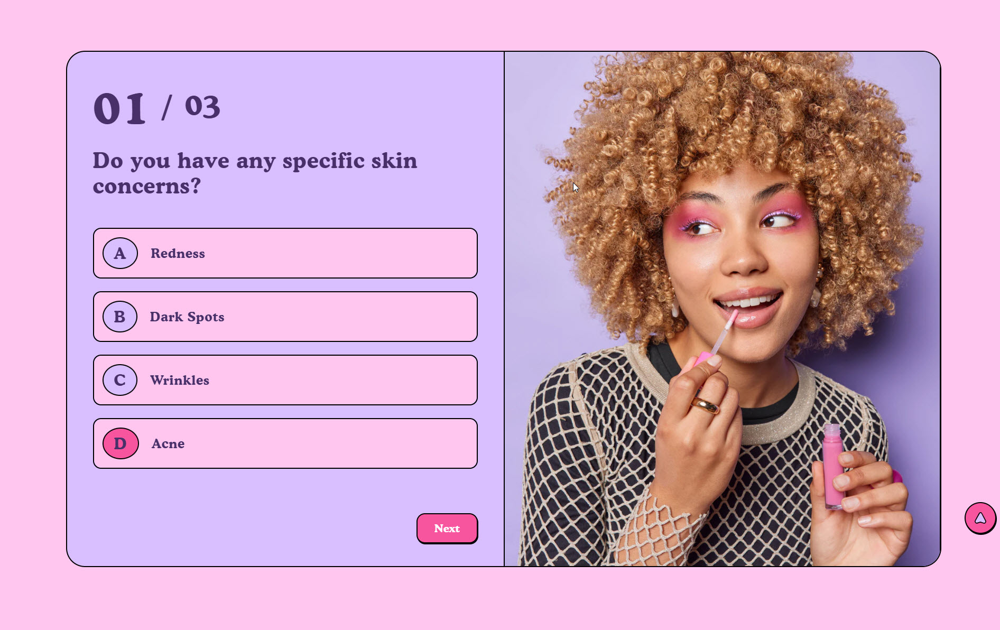
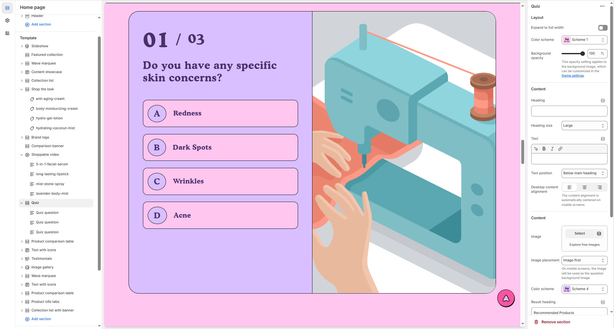
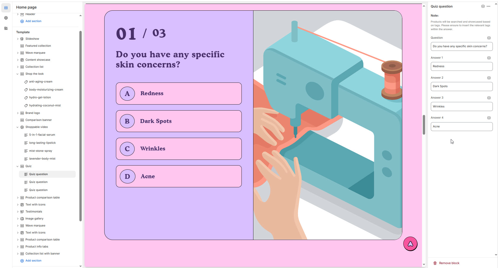

# Quiz Section

The **Quiz Section** is an interactive tool that allows customers to answer a series of questions to receive personalized product recommendations. Whether you are selling beauty products, clothing, or tech gadgets, a quiz can guide shoppers to the perfect product based on their preferences, needs, and styles.


1. **Go to Shopify Admin** > Online Store > Themes.
2. Click **Customize** on your active theme.
3. In the theme editor, click **Add Section** > **Quiz**
4. Customize the quiz by adding **questions**, **answer options**, and **product recommendations** based on responses.


<figure><figcaption></figcaption></figure>

### **Settings & Customization** 

<figure><figcaption></figcaption></figure>

#### **Layout**

* **Expand to Full Width:** Enable this option to extend the section across the entire screen width.
* **Color scheme:** You can customize the section’s appearance by changing the **text color, background color**, and more using **preset color** options.
* **Background Opacity:** Adjust transparency (**Range: 0–100**, Default: **100**). This applies to the background image, customizable in theme settings.

#### **Content Settings**

* **Heading:** Set a custom title (e.g., _"Find Your Perfect Match!"_).
* **Heading Size:** Choose from **Small, Medium, or Large** (Default: **Large**).
* **Subheading:** Add additional descriptive text if needed.
* **Text Position:** Choose placement relative to the heading:
  * **Above Main Heading** – Display subheading above the main heading.
  * **Below Main Heading** – Display subheading below the main heading (**Default**).
* **Desktop Content Alignment:** Align content to **Left, Right, or Center** (automatically centered on mobile screens).

#### **Image Settings**

* **Upload Image:** Add a visual for the quiz (**Recommended: High-quality image**).
* **Image Placement:** Choose **Image First** (Default). On mobile screens, the image will be used as the quiz question background.
* **Color Scheme:** Choose a preset color scheme for the quiz background.

#### **Quiz Result Settings**

* **Result Heading:** Set a custom heading for the results sidebar (Default: _"Recommended Products"_).

#### **Section Padding**

* **Top Padding:** Adjust spacing above the section (**Default: 0px**).
* **Bottom Padding:** Adjust spacing below the section (**Default: 160px**).

#### **Shapes & Styling**

* **Shaper:** Add visual elements (**None, Shaper Top, Shaper Bottom, Both, Borders**).
* **Shaper Top Color:** Customize the top shape color ( _choose your preferred color_).
* **Shaper Bottom Color:** Customize the bottom shape color ( _choose your preferred color_ ).

#### **Theme Customization**

* **Custom CSS:** Add additional styling adjustments if needed.
* **Remove Section:** Option to delete this section from the page layout.

### **Quiz Section**

<figure><figcaption></figcaption></figure>

#### **Add Quiz Question**

* **Question:** _Add your question here_

**Answers & Product Matching**

* **Answer 1:** _Add your choice of answer_
* **Answer 2:** _Add your choice of answer_
* **Answer 3:** _Add your choice of answer_
* **Answer 4:** _Add your choice of answer_

**Tag-Based Product Matching**

* Products will be searched and showcased based on **tags**.
* Ensure that **relevant tags** are added to products so they appear in the quiz results.
