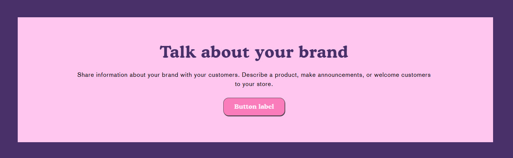
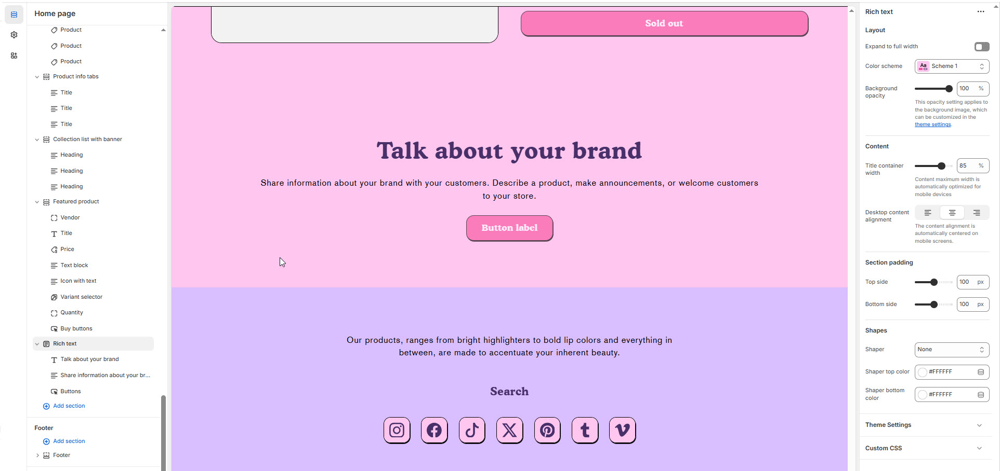

# Rich Text

The **Rich Text Section** allows you to add customizable text content to your store’s pages. It is ideal for displaying **announcements, brand messaging, promotional details, or any important information** in a structured format.


1. **Go to** Shopify Admin > Online Store > Themes.
2. **Click** Customize on your active theme.
3. In the theme editor, **click** Add Section > Rich Text.


<figure><figcaption></figcaption></figure>

### **Settings & Customization**

<figure><figcaption></figcaption></figure>

#### **Layout**

* **Expand to Full Width** : Enable this option to extend the announcement bar across the entire screen width.
* **Color scheme:** You can customize the section’s appearance by changing the **text color, background color**, and more using **preset color** options.
* **Background Opacity** : Set the transparency level (Range: 0–100, Default: 100).\
  \&#xNAN;_This setting applies to the background image, which can be customized in the theme settings._

#### **Content Settings**

* **Title Container Width** – Customize the width of the content container (e.g., 85%).\
  \&#xNAN;_The content width is automatically optimized for mobile devices._
* **Desktop Content Alignment** – Choose the text alignment for desktop. **( Left, Right & Center ).** The content alignment is automatically centered on mobile screens.

#### Section padding

* **Top & Bottom Padding:** Adjust the spacing above and below the section for a well-structured layout.

#### **Shapes**

* **Shaper** – Adds shape effects to the section. Options: **Shaper Top, Shaper Bottom, Shaper Both, None, Border Top, Border Bottom, and Both Borders**.
* **Shaper Top Color** – Sets the top shape color (_choose your preferred color_).
* **Shaper Bottom Color** – Sets the bottom shape color (_choose your preferred color_).

#### **Theme Settings & Customization**

* Adjust additional styles in **Theme Settings**.
* Use **Custom CSS** for further design modifications.
