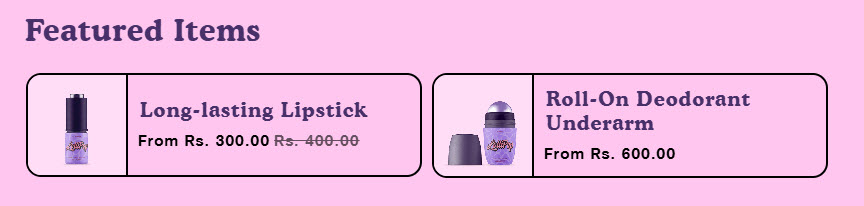
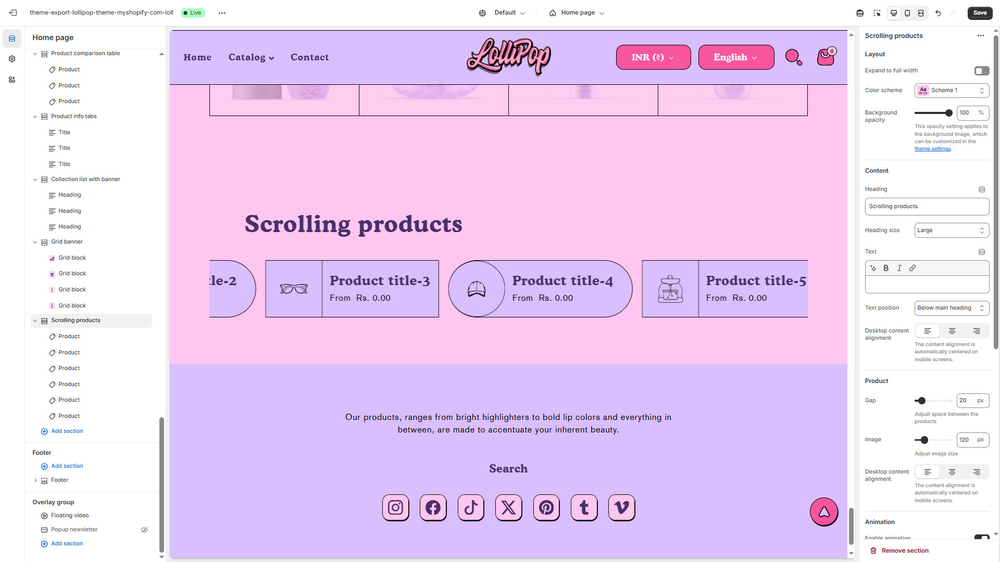
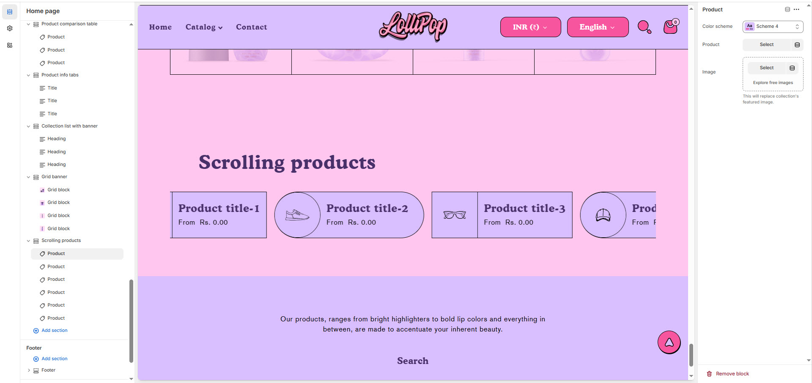

# Scrolling products

The **Scrolling Products** section enables customers to explore multiple products in a smooth, horizontal scrolling format. This feature enhances user engagement and makes browsing more convenient, especially on mobile devices.


1. **Go to Shopify Admin** > Online Store > Themes.
2. Click **Customize** on your active theme.
3. Click **Add Section** > **Scrolling Products**
4. Adjust **scroll speed, number of visible products, and autoplay settings** for a smooth experience.


<figure><figcaption></figcaption></figure>

### **Settings & Customization**

<figure><figcaption></figcaption></figure>

#### **Layout** 

* **Expand to Full Width:** Enable this option to extend the section across the entire screen width.
* **Color scheme:** You can customize the section’s appearance by changing the **text color, background color**, and more using **preset color** options.
* **Background Opacity:** Set the transparency level (Range: **0–100**, Default: **100**). This applies to the background image, which can be customized in the theme settings.

#### Content Settings 

* **Heading:** Set a custom title (**e.g., "Scrolling Products"**).
* **Heading Size:** Choose from **Small, Medium, or Large** (**Default: Medium**).
* **Subheading:** Add additional text if needed.
* **Text Position :** Select the Position
  * **Above Main Heading** – Position the subheading above the main heading.
  * **Below main heading** – Position the subheading below the main heading.
* **Desktop Content Alignment** – Choose the text alignment for desktop. **( Left, Right & Center ).** The content alignment is automatically centered on mobile screens.

#### **Product Display**

* **Gap Between Products:** Adjust spacing between products (**Default: 20px**).
* **Image Size:** Customize product image dimensions (**Default: 120px**).

#### **Animation Settings**

* **Enable Animation:** Enable to create a scrolling effect.
* **Reverse Animation:** Adjust scrolling direction.
* **Speed:** Set scrolling speed (**Default: 20 seconds**).

#### Section padding 

* **Top & Bottom Padding:** Adjust the spacing above and below the section for a well-structured layout.

#### **Shapes** 

* **Shaper** – Adds shape effects to the section. Options: **Shaper Top, Shaper Bottom, Shaper Both, None, Border Top, Border Bottom, and Both Borders**.
* **Shaper Top Color** – Sets the top shape color (_choose your preferred color_).
* **Shaper Bottom Color** – Sets the bottom shape color ( &#x63;_&#x68;oose your preferred color_).

<figure><figcaption></figcaption></figure>

### **Product Section Settings**

* **Color Scheme:** You can customize the section’s appearance by changing the **text color, background color**, and more using **preset color** options..
* **Product:** Select a specific product to display.
* **Upload Image:** Choose a custom image for the product.
* **Explore Free Images:** Select from a collection of free images.\
  \&#xNAN;_(This will replace the collection's featured image.)_
