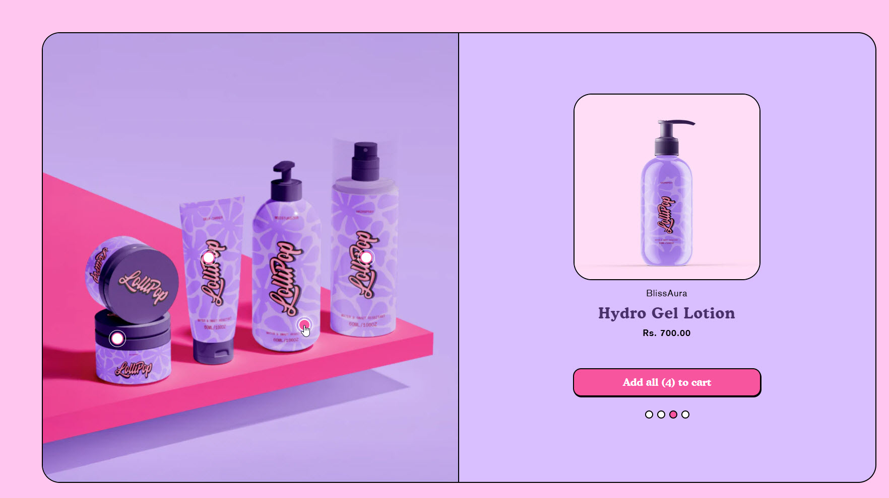
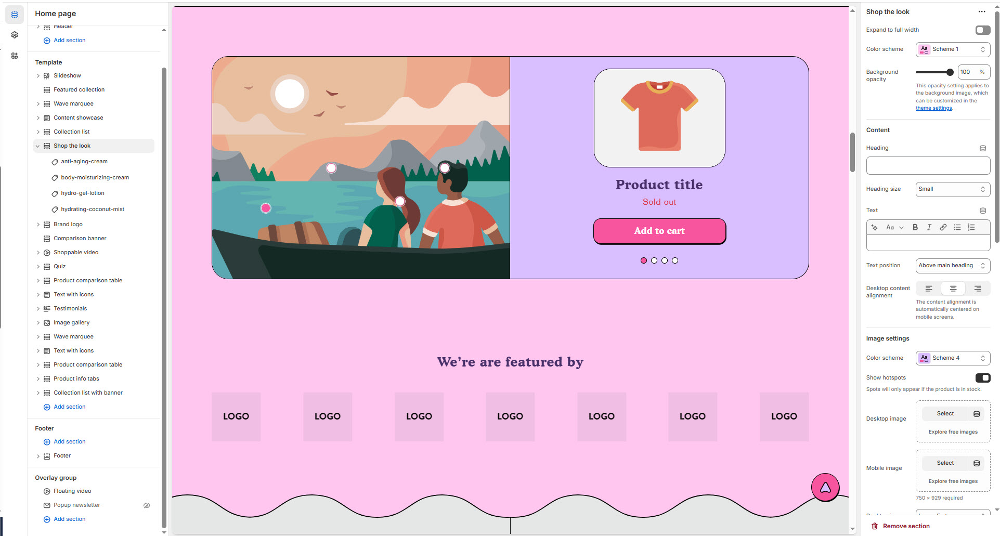
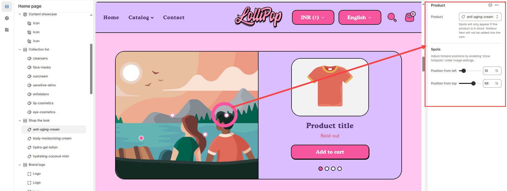

# Shop the look

The **Shop the Look** section allows you to showcase complete outfits or product sets, enabling customers to purchase multiple items directly from a single image. This feature enhances the shopping experience by providing a visually engaging and convenient way to explore curated product combinations.


1. **Go to Shopify Admin** > Online Store > Themes.
2. Click **Customize** on your active theme.
3. In the theme editor, click **Add Section** > Shop the Look.
4. Customize the section by adding **products, images, and descriptions** to create an engaging shopping experience.


<figure><figcaption>
<strong>Shop the Look</strong>
</figcaption></figure>

### **Settings & Customization**

<figure><figcaption>
<strong>Shop the Look</strong>
</figcaption></figure>

#### **Layout**

* **Expand to Full Width:** Enable this option to extend the section across the entire screen width.
* **Color scheme:** You can customize the section’s appearance by changing the **text color, background color**, and more using **preset color** options.
* **Background Opacity:** Set the transparency level (Range: **0–100**, Default: **100**). This applies to the background image, which can be customized in the theme settings.

#### **Content Settings**

* **Heading:** Set a custom title (e.g., _"Complete Your Look"_)
* **Heading Size:** Choose from **Small, Medium, or Large** (Default: **Medium**).
* **Subheading:** Add additional descriptive text if needed.
* **Text Position:** Choose the placement of the subheading:
  * **Above Main Heading** – Position the subheading above the main heading.
  * **Below Main Heading** – Position the subheading below the main heading.
* **Desktop Content Alignment:** Align content to **Left, Right, or Center** (automatically centered on mobile screens).

#### **Image Settings**

* **Color Scheme:** Choose a preset color scheme for the image background.
* **Show Hotspots:** Enable product hotspots (visible only for in-stock products).
* **Desktop Image:** Upload a high-resolution image.
* **Mobile Image:** Upload a separate image optimized for mobile (Recommended size: **750 × 929 px**).
* **Desktop Image Placement:** Options: **Image First** and **Image second** (default for mobile layout).

#### **Product Settings**

* **Aspect Ratio:** Select how product images appear: **Square, Portrait, or Adapt to Image**.
* **Show Vendor:** Display the brand or vendor name under each product.
* **Show Secondary Image on Hover:** Enable to show an alternative image on hover.
* **Column Alignment:** Adjust alignment of product cards.
* **Mobile content alignment :** Align content to **Left, Right, or Center**

#### **Carousel Settings**

* **Desktop Columns** – Choose the column option: **1** or **2**.
* **Change Slides Every:** Set the transition delay (in seconds). If set to **0**, auto-play is disabled.
* **Gap:** Define spacing between items (**Default: 10px**, auto-adjusts for mobile).
* **Pagination** – Choose the pagination type: **Dots** (dot indicators), **Arrow** (manual navigation), or **None** (no indicators).
* **Pagination Style** – Choose the style: **Classic** (traditional) or **Modern** (updated look).

#### **Section Padding**

* **Top & Bottom Padding:** Customize the spacing for better section structure.

#### **Shapes**

* **Shaper** – Adds shape effects to the section. Options: **Shaper Top, Shaper Bottom, Shaper Both, None, Border Top, Border Bottom, and Both Borders**.
* **Shaper Top Color** – Sets the top shape color (_choose your preferred color_).
* **Shaper Bottom Color** – Sets the bottom shape color (_choose your preferred color_).

#### **Theme Settings & Customization**

* Adjust additional styles in **Theme Settings**.
* Use **Custom CSS** for further design modifications.

### **Shop the Look Section**


In the theme editor, click **Add Section** > Shop the Look > **Add Product**


<figure><figcaption>
<strong>Shop the Look > Add Product</strong>
</figcaption></figure>

**Add Product**

* **Product:** Select a product for display (e.g., _anti-aging-cream_).
* **Product Availability:**
  * Spots will only appear if the product is in stock. Sold-out items will not be added to the cart.

**Hotspot Settings**

* **Enable Hotspots:** Ensure that "Show hotspots" is enabled under the image settings for hotspots to be visible.
* **Position from Left:** Set the horizontal position of the hotspot (Default: **18**).
* **Position from Top:** Set the vertical position of the hotspot (Default: **68**).
