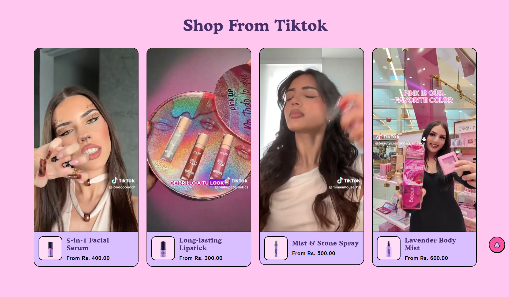
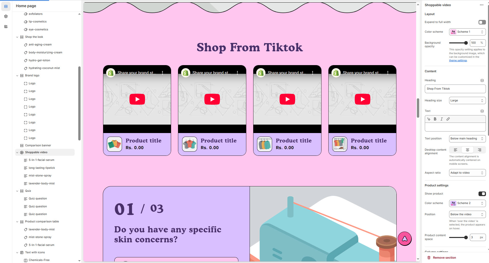
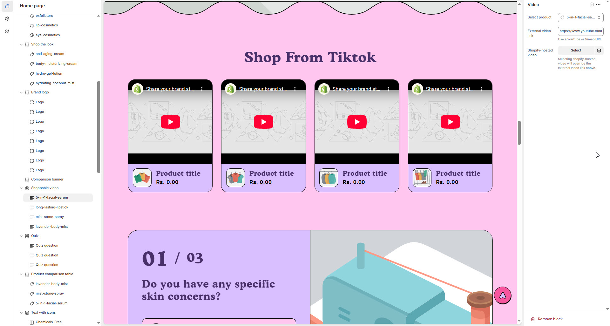

# Shoppable Video

A **Shoppable Video** enables customers to purchase items featured in a video without leaving the page. By tagging products directly in the video, you create an immersive shopping experience that blends entertainment with commerce.


1. **Go to Shopify Admin** > Online Store > Themes.
2. Click **Customize** on your active theme.
3. In the theme editor, click **Add Section** > **Shoppable Video**
4. Customize the appearance by adjusting **video placement**, **product tags**, and **links** to ensure smooth navigation.


<figure><figcaption>
<strong>Add Section</strong> > <strong>Shoppable Video</strong>
</figcaption></figure>

### **Settings & Customization**

<figure><figcaption></figcaption></figure>

#### L**ayout**

* **Expand to Full Width:** Enable this option to extend the section across the entire screen width.
* **Color scheme:** You can customize the section’s appearance by changing the **text color, background color**, and more using **preset color** options.
* **Background Opacity:** Adjust transparency (**Range: 0–100**, Default: **100**). This applies to the background image, customizable in theme settings.

#### **Content Settings**

* **Heading:** Set a custom title (Default: _"Shop From TikTok"_).
* **Heading Size:** Choose from **Small, Medium, or Large** (Default: **Large**).
* **Subheading:** Add additional descriptive text if needed.
* **Text Position:** Choose placement relative to the heading:
  * **Above Main Heading** – Display subheading above the main heading.
  * **Below Main Heading** – Display subheading below the main heading (**Default**).
* **Desktop Content Alignment:** Align content to **Left, Right, or Center** (automatically centered on mobile screens).
* **Aspect Ratio:** Choose how the video scales **Square, Portrait, or Adapt to Video** .

#### **Product Settings**

* **Show Product:** Enable to display featured products linked to the video.
* **Product Color Scheme:** Choose a preset color scheme for background and text.
* **Product Position:**
  * **Below the Video** – Displays products under the video (**Default**).
  * **Over the Video** – Products appear on hover.
* **Product Content Space:** Adjust spacing between products (**Default: 3px**).

#### **Column Settings**

* **Desktop Columns:** Choose **3, 4, or 5** columns (automatically adjusts to a single column on mobile).

#### **Carousel Settings**

* **Enable Carousel:** Activate a sliding format for product display.
* **Change Slides Every:** Set transition delay (in seconds). If set to **0**, auto-play is disabled.
* **Gap:** Define spacing between items (**Default: 30px**, auto-adjusts for mobile).
* **Pagination** – Choose the pagination type: **Dots** (dot indicators), **Arrow** (manual navigation), or **None** (no indicators).
* **Pagination Style** – Choose the style: **Classic** (traditional) or **Modern** (updated look).

#### **Section Padding**

* **Top Padding:** Adjust spacing above the section (**Default: 120px**).
* **Bottom Padding:** Adjust spacing below the section (**Default: 132px**).

#### **Shapes & Styling**

* **Shaper:** Add visual elements (**None, Shaper Top, Shaper Bottom, Both, Borders**).
* **Shaper Top Color:** Customize the top shape color (_choose your preferred color_).
* **Shaper Bottom Color:** Customize the bottom shape color (_choose your preferred color_).

#### **Theme Customization**

* **Custom CSS:** Add additional styling adjustments if needed.
* **Remove Section:** Option to delete this section from the page layout.

<figure><figcaption></figcaption></figure>


click **Shoppable Video > Add Video**


### **Add Video**

* **Select Product:** Choose the product featured in the video (_e.g., 5-in-1-facial-serum_).
* **External Video Link:**
  * Add a YouTube or Vimeo URL (**e.g.,** `https://www.youtube.com/watch?v=_9VUPq3SxOc`).
  * Helps share your brand story by embedding a video directly into your store.

#### **Shopify-Hosted Video (Optional)**

* **Upload a Shopify-Hosted Video:** Selecting a Shopify-hosted video will override the external video link above.
* **Use this option** if you prefer to host your videos directly on Shopify for better performance and control.
