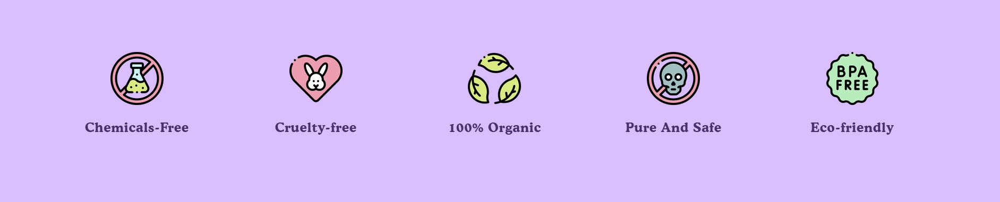
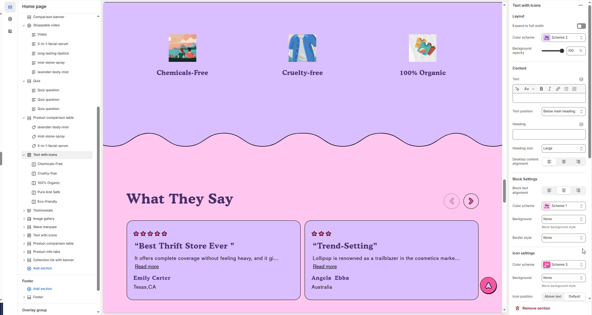
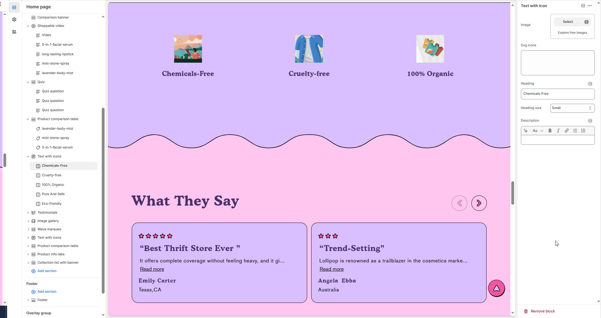

# Text with Icons

The **Text with Icons** section allows you to display important information using visual icons alongside text. This is ideal for highlighting **product features, benefits, shipping policies, guarantees**, or any key details in a structured and attractive format.


1. **Go to Shopify Admin** > Online Store > Themes.
2. Click **Customize** on your active theme.
3. In the theme editor, click **Add Section** > **Text with Icons**.
4. Customize the section by:
   * Selecting **icons** (e.g., shipping, support, warranty).
   * Adding **headings & descriptions**.
   * Adjusting **layout and colors** to match your store’s branding.


<figure><figcaption></figcaption></figure>

### **Settings & Customization**

<figure><figcaption></figcaption></figure>

#### **Layout**

* **Expand to Full Width:** Enable this option to extend the section across the entire screen width.
* **Color scheme:** You can customize the section’s appearance by changing the **text color, background color**, and more using **preset color** options.
* **Background Opacity:** Set the transparency level (Range: 0–100, Default: 100).\
  \&#xNAN;_This setting applies to the background image, which can be customized in the theme settings._

#### **Content Settings**

* **Heading:** Set a custom title (e.g., "Our Features").
* **Heading Size:** Choose from Small, Medium, or Large (Default: Medium).
* **Subheading:** Add additional text if needed.
* **Text Position:** Select the position:
  * _Above Main Heading_ – Position the subheading above the main heading.
  * _Below Main Heading_ – Position the subheading below the main heading.
* **Desktop Content Alignment:** Choose the text alignment for desktop (_Left, Center, or Right_).\
  \&#xNAN;_The content alignment is automatically centered on mobile screens._

#### **Block Settings**

* **Block Text Alignment:** Choose Left, Center, or Right.
* **Color Scheme:** Select a predefined scheme for text and background colors.
* **Background Style:** Choose None or Border Style.
* **Background Style:** Choose a background type for the block (_e.g., Column Background_ ).
* **Border Style:** Apply a border effect to the block (_Options: None,_ Full borde&#x72;_,_ Vertical border).

#### **Icon Settings**

* **Icon Color Scheme:** Customize the icon’s colors with preset options.
* **Icon Background Style:** Choose None or select a custom background.
* **Icon Position**: Choose between _Above Text_ (icon displayed above the text) or _Default_ (standard inline position).
* **Icon Style**: Select _Rotate_ to animate the icon or _Default_ for a static appearance.
* **Image Width:** Set the icon size (Default: 100px).

#### **Column Settings**

* **Desktop Columns:** Choose between _3, 4, or 5_ columns for desktop.

#### **Carousel Settings&#x20;**_**(Optional)**_

* **Enable Carousel:** Enable to display the section as a sliding carousel.
* **Change Slides Every:** Set the transition delay (in seconds). If set to 0, auto-play will be disabled.
* **Gap:** Define spacing between icons (Default: 30px).\
  \&#xNAN;_Note: Vertical borders disable gaps._
* **Pagination** – Choose the pagination type: **Dots** (dot indicators), **Arrow** (manual navigation), or **None** (no indicators).
* **Pagination Style** – Choose the style: **Classic** (traditional) or **Modern** (updated look).

#### **Section Padding**

* **Top & Bottom Padding:** Adjust the spacing above and below the section for a well-structured layout.

#### **Shapes & Styling**

* **Shaper:** Add visual elements (**None, Shaper Top, Shaper Bottom, Both, Borders**).
* **Shaper Top Color:** Customize the top shape color ( _choose your preferred color_).
* **Shaper Bottom Color:** Customize the bottom shape color ( _choose your preferred color_ ).

<figure><figcaption></figcaption></figure>


**Text with Icons > Add Text with Icons**


**Image Settings**

* **Upload Image:** Choose an image for the icon representation.
  * _Select from your device or explore free images._
* **SVG Icons:** Upload an SVG icon for better scalability and performance.

**Content Settings**

* **Heading:** Set a custom title (e.g., "Chemicals-Free").
* **Heading Size:** Choose from _Small, Medium, or Large_ (Default: Small).
* **Description:** Add a brief text description to provide additional details about the icon feature.
