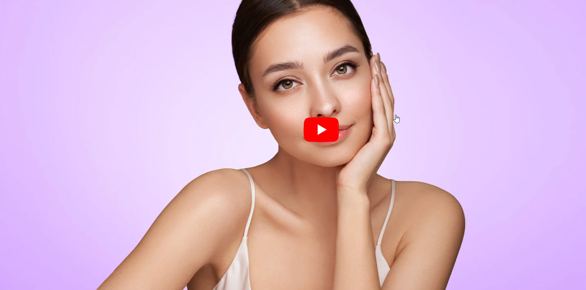
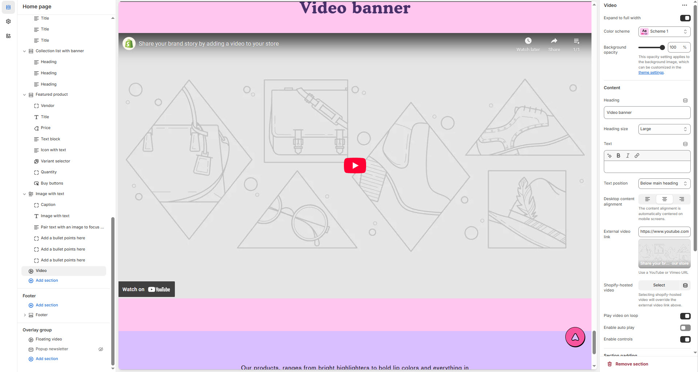

# Video Section

The **Video Section** allows you to embed and showcase videos in your store, providing an engaging way to present **brand stories, product demonstrations, or promotions**.


1. **Go to** Shopify Admin > **Online Store > Themes**.
2. Click **Customize** on your active theme.
3. In the Theme Editor, click **Add Section > Video**.


<figure><figcaption></figcaption></figure>

### **Settings & Customization**

<figure><figcaption></figcaption></figure>

#### **Layout** 

* **Expand to Full Width:** Enable this option to extend the section across the entire screen width.
* **Color scheme:** You can customize the section’s appearance by changing the **text color, background color**, and more using **preset color** options.
* **Background Opacity:** Set the transparency level (Range: **0–100**, Default: **100**). This applies to the background image, which can be customized in the theme settings.

#### **Content Settings**

* **Heading:** Set a custom title (e.g., _"Video Banner"_).
* **Heading Size:** Choose from **Small, Medium, or Large** (Default: **Large**).
* **Text Position:**
  * **Above Main Heading** – Position the text above the heading.
  * **Below Main Heading** – Position the text below the heading (Default).
* **Desktop Content Alignment:** Choose from **Left, Right, or Center** (Automatically centered on mobile screens).

#### **Video Options**

* **External Video Link:** Use a YouTube or Vimeo URL.\
  \&#xNAN;_(Example:_ [_YouTube Video_](https://www.youtube.com/watch?v=_9VUPq3SxOc)_)_
* **Shopify-Hosted Video:** Upload a video directly.\
  \*(_Selecting this option will override the external video link.)_
* **Playback Options:**
  * **Enable Auto-Play:** Video starts playing automatically.
  * **Play Video on Loop:** Video plays continuously.
  * **Enable Controls:** Show or hide video controls.

#### **Section Padding** 

* **Top & Bottom Padding:** Customize the spacing for better section structure.

#### **Shapes** 

* **Shaper** – Adds shape effects to the section. Options: **Shaper Top, Shaper Bottom, Shaper Both, None, Border Top, Border Bottom, and Both Borders**.
* **Shaper Top Color** – Sets the top shape color (_choose your preferred color_).
* **Shaper Bottom Color** – Sets the bottom shape color (_choose your preferred color_).

#### **Theme Settings & Customization** 

* Adjust additional styles in **Theme Settings**.
* Use **Custom CSS** for further design modifications.
