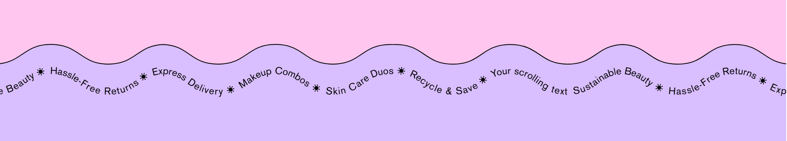
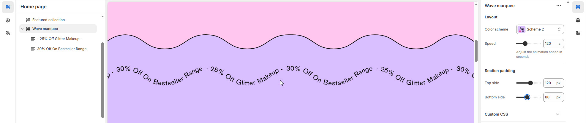
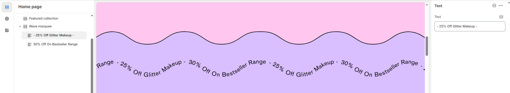

# Wave Marquee

The **Wave Marquee** section is a dynamic scrolling text feature that creates an engaging visual effect. It allows you to display important messages, promotions, or announcements in a continuous looping motion.

<figure><figcaption></figcaption></figure>


1. **Navigate to** Shopify Admin > Online Store > Themes.
2. **Click** Customize on your active theme.
3. **In the Theme Editor**, click **Add Section >** **Wave Marquee** .


### **Settings & Customization**

<figure><figcaption></figcaption></figure>

**Layout**

* **Color scheme :** You can customize the section’s appearance by changing the **text color, background color**, and more using preset color options.
* **Speed :** Set the speed of the scrolling text ( Adjust the animation speed in seconds) .

#### **Section Spacing**

**Top & Bottom Padding:** Adjust the spacing above and below the section for a well-structured layout.

<figure><figcaption></figcaption></figure>


**Section >** **Wave Marquee > Add Text**


### **Text**

* **Text Content** – Enter the marquee text (e.g., _"New Arrivals – Shop Now!"_).

**Theme Settings & Customization**

* Adjust additional styles in **Theme Settings**.
* Use **Custom CSS** for further design modifications.
