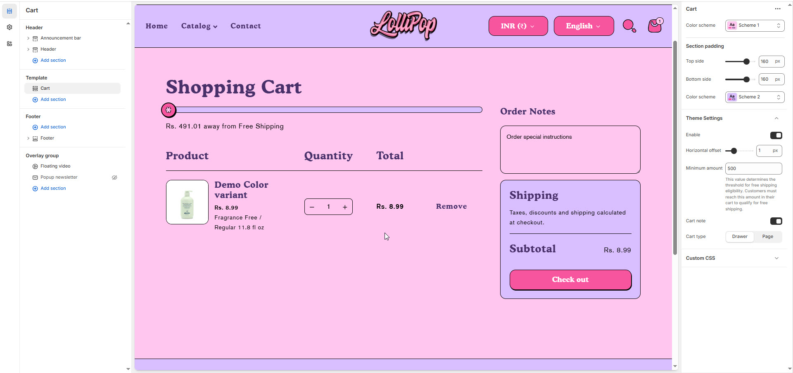

# Template- Cart

**Cart Template** in Shopify controls the layout and functionality of the **cart page**, where customers review products before checkout.


1. Go to **Online Store > Themes > Customize**
2. In the **top dropdown**, select **Cart**
3. From the **left sidebar**, select the **Cart** section (usually named “Cart,” “Main Cart,” or “Cart Items”)


<figure><figcaption></figcaption></figure>

**Cart**

* **Color Scheme**: Customize the section’s appearance using preset text and background color options.

**Section Padding**

* **Top & Bottom Padding**: Customize the spacing above and below the collections section. (Default: 100 for both)

**Theme Settings**

* **Enable**: Toggle to activate custom cart options and styling.
* **Horizontal Offset**: Adjust the horizontal position of the cart drawer or elements within the cart layout. _(Default: 1)_
* **Minimum Amount**: Set the minimum cart value (e.g., **500**) required to offer free shipping.\
  \&#xNAN;_This encourages customers to add more items to qualify for shipping benefits._
* **Cart Note**: Enable a note field where customers can leave special instructions or messages related to their order.
* **Cart Type**: Choose how the cart is displayed:
  * **Drawer**: Opens as a side panel overlay, allowing customers to continue browsing without leaving the page.
  * **Page**: Redirects to a full cart page with detailed information.
