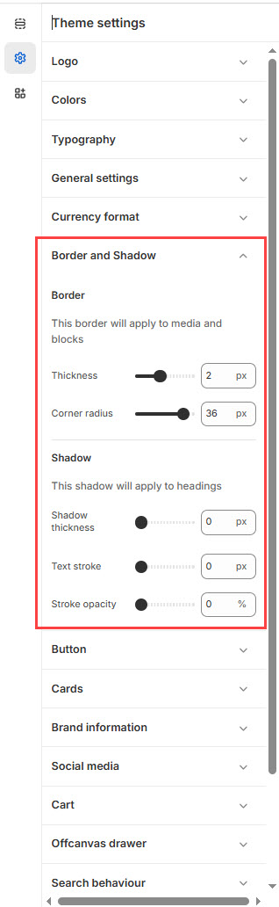

# Border and Shadow

The **Border and Shadow** settings in Shopify allow you to customize the appearance of elements like **product cards, buttons, sections, and images** by adding **borders, rounded corners, and shadow effects**. These settings help enhance the design and user experience of your store.


1. **Go to** Shopify Admin > **Online Store > Themes**.
2. Click **Customize** on your active theme.
3. In the Theme Editor, click **Theme Settings >**&#x42;order and Shadow


<figure><figcaption></figcaption></figure>

### **Customization Options:**

#### **Border**

* **Border**: Applies to media elements and content blocks across the theme.
* **Thickness**: Set the thickness of the border.
* **Corner Radius**: Define how rounded the corners appear.

#### **Shadow**

* **Shadow**: Applies specifically to headings for added depth or emphasis.
* **Shadow Thickness**: Control the intensity of the shadow effect.

#### **Text Stroke**

* **Text Stroke**: Outlines headings or large text for visual impact.
* **Stroke Opacity**: Controls the transparency of the stroke.
