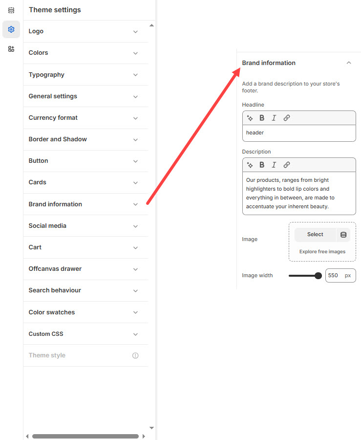

# Brand Information

The **Brand Information** section in Shopify allows you to showcase your store's branding, including your **brand name, logo, description, colors, and social media links**. This helps customers recognize and trust your brand.


1. **Go to** Shopify Admin > **Online Store > Themes**.
2. Click **Customize** on your active theme.
3. In the Theme Editor, click **Theme Settings > Brand Information**


<figure><figcaption></figcaption></figure>

#### **Brand Description**

* **Headline:** Set a custom heading for the brand section in the footer. (_Example:_ header)
* **Description:** Add a brief brand introduction or tagline.
  * _Example:_ _"Our products, ranging from bright highlighters to bold lip colors and everything in between, are made to accentuate your inherent beauty."_

#### **Brand Image**

* **Upload Image:** Add a brand-related image to enhance the section.
* **Image Width:** Adjust the display size of the image. _(Default: 550px)_
