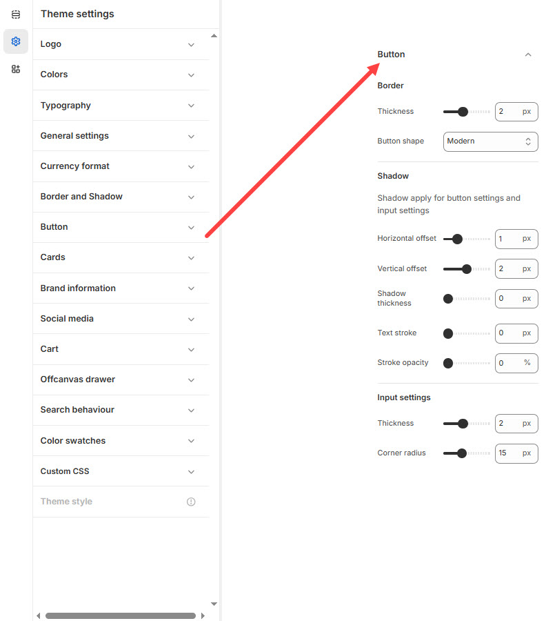

# Button

Buttons are essential elements in your Shopify store, guiding users to **add products to the cart, checkout, or explore more pages**. Shopify allows you to customize buttons to match your branding and improve user engagement.


1. **Go to** Shopify Admin > **Online Store > Themes**.
2. Click **Customize** on your active theme.
3. In the Theme Editor, click **Theme Settings > Button**


<figure><figcaption></figcaption></figure>

#### **Border**

* **Thickness:** Defines the border thickness for buttons. _(Default: 2px)_
* **Button Shape:** Select the button style. _(Options: Classic, Modern and Default )_

#### **Shadow**

* **Shadow Application:** Applies shadows to buttons and input fields.
* **Horizontal Offset:** Adjusts the shadow position on the X-axis. _(Default: 1px)_
* **Vertical Offset:** Adjusts the shadow position on the Y-axis. _(Default: 2px)_
* **Shadow Thickness:** Defines the intensity of the shadow. _(Default: 0px)_
* **Text Stroke:** Sets the thickness of the text outline. _(Default: 0px)_
* **Stroke Opacity:** Controls the transparency of the text stroke. _(Default: 0%)_

#### **Input Settings**

* **Thickness:** Defines the border thickness for input fields. _(Default: 2px)_
* **Corner Radius:** Adjusts the roundness of input field corners. _(Default: 15px)_
