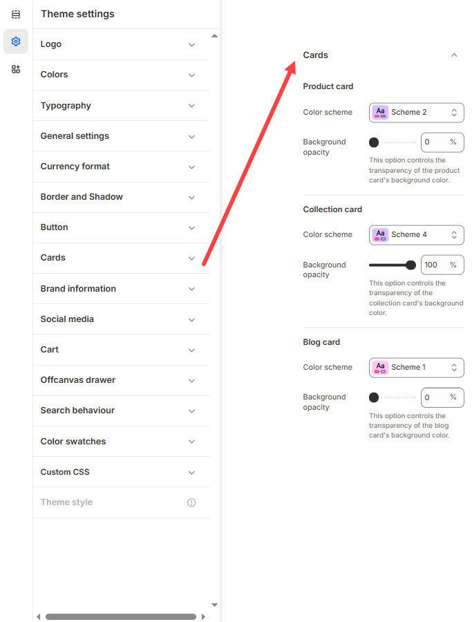

# Cards

**Cards** in Shopify are used to display products, collections, blog posts, or promotions in a structured layout. They typically include an **image, title, price, description, and buttons** (e.g., "Add to Cart" or "View More").


1. **Go to** Shopify Admin > **Online Store > Themes**.
2. Click **Customize** on your active theme.
3. In the Theme Editor, click **Theme Settings > Cards**


<figure><figcaption></figcaption></figure>

#### **Product Card**

* **Color scheme :** You can customize the theme appearance by changing the **text color, background color**, and more using preset color options.
* **Background Opacity:** Controls the transparency of the product card's background. _(Range: 0–100, Default: 0)_

#### **Collection Card**

* **Color scheme :** You can customize the theme appearance by changing the **text color, background color**, and more using preset color options.
* **Background Opacity:** Controls the transparency of the collection card's background. _(Range: 0–100, Default: 100)_

#### **Blog Card**

* **Color scheme :** You can customize the theme appearance by changing the **text color, background color**, and more using preset color options.
* **Background Opacity:** Controls the transparency of the blog card's background. _(Range: 0–100, Default: 0)_
