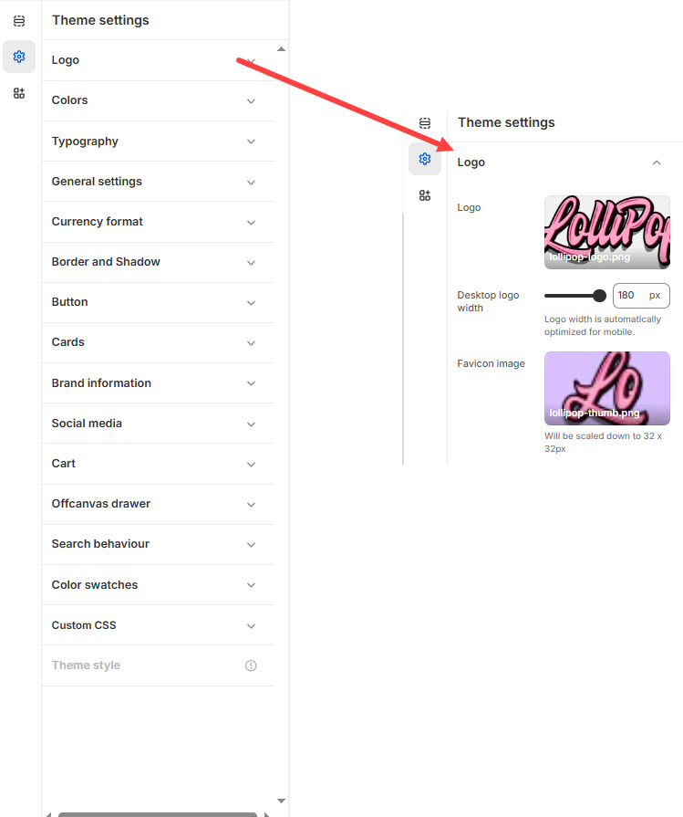

# Logo

**Logo and Favicon** settings under **Theme Settings** allow you to upload and customize your store’s **logo** (for your header and footer) and **favicon** (the small icon shown in browser tabs).


1. **Go to** Shopify Admin > **Online Store > Themes**.
2. Click **Customize** on your active theme.
3. In the Theme Editor, click **Theme Settings** > **Logo** from the left panel.


<figure><figcaption></figcaption></figure>

#### **Logo Settings**

* **Upload Logo** – Add a custom logo for your website. Supported file formats: PNG, JPG, SVG.
* **Desktop Logo Width** – Set the width of the logo (Default: 180px).
* _Note:_ The logo width is automatically optimized for mobile devices.

#### **Favicon Settings**

* **Upload Favicon** – Add a favicon image to be displayed in the browser tab.
* **Favicon Size** – The uploaded image will be scaled down to **32 × 32px** for optimal display.
* **Upload Logo**: Click **Upload Image** and add your logo.
* **Adjust Logo Width**: Look for the **Logo width setting** and adjust it (in pixels or percentage).
