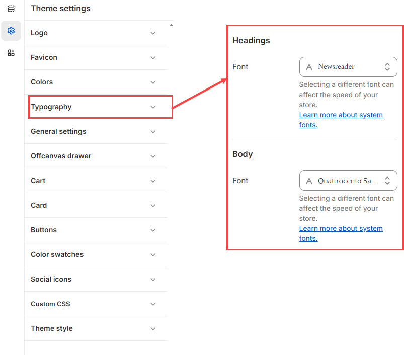

# Typography

With the Typography settings, you have the freedom to personalize the font styles, sizes, and letter casing for your entire store.


1. **Go to** Shopify Admin > **Online Store > Themes**.
2. Click **Customize** on your active theme.
3. In the Theme Editor, click **Theme Settings > Typography** .


<figure><figcaption></figcaption></figure>

**Headings**

* Configure the **font type** and **size** for all headings used in the theme.
* Choose from available font styles to match your brand identity.

**Body Text**

* The theme primarily uses the **body font** as the main font type.
* Customize the **font type** and **size** to ensure readability and consistency across your store.
