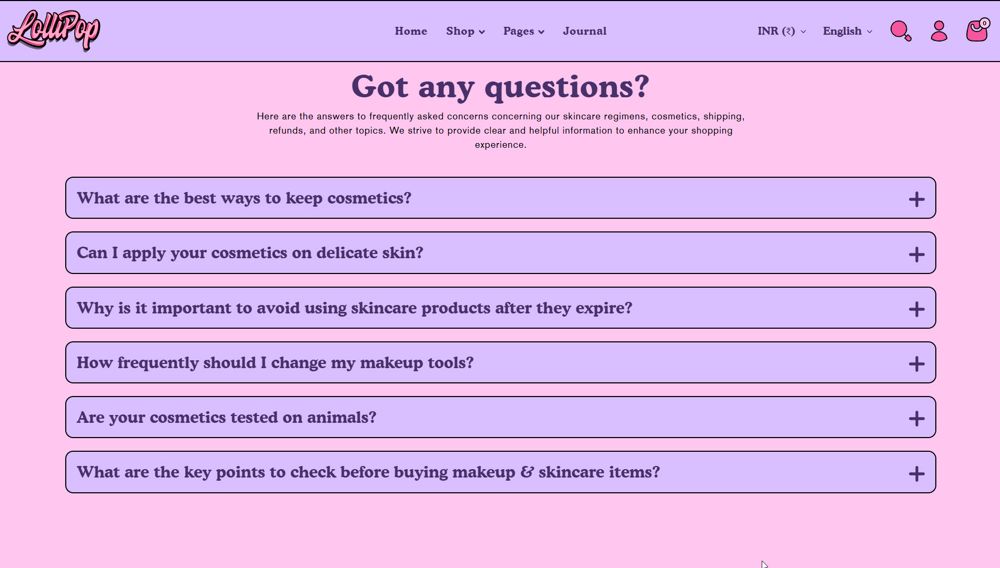
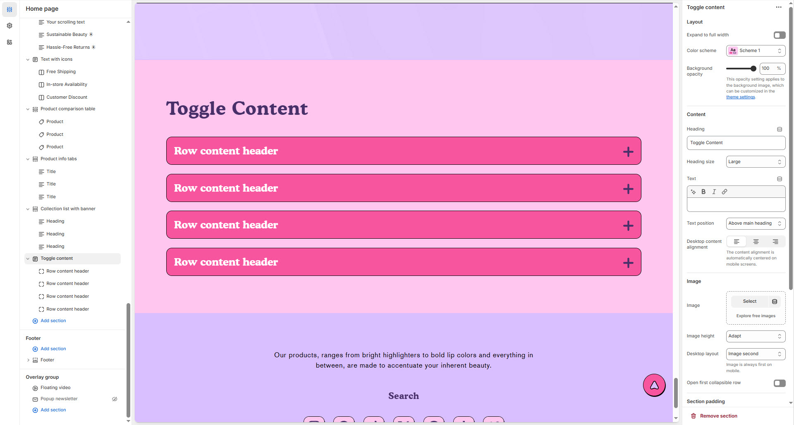

# Toggle content

**Toggle Content** a collapsible section that expands or hides content when clicked—ideal for FAQs, product details, or policies.


1. **Go to** Shopify Admin > **Online Store > Themes**.
2. Click **Customize** on your active theme.
3. In the Theme Editor, click **Add Section >Toggle conten**t


<figure><figcaption></figcaption></figure>

### **Settings & Customization**

<figure><figcaption></figcaption></figure>

#### **Layout** 

* **Expand to Full Width:** Enable this option to extend the section across the entire screen width.
* **Color scheme:** You can customize the section’s appearance by changing the **text color, background color**, and more using **preset color** options.
* **Background Opacity:** Set the transparency level (Range: **0–100**, Default: **100**). This applies to the background image, which can be customized in the theme settings.

#### **Content Settings**

* **Heading:** Set a custom title (e.g., _"_&#x57;e’re are featured b&#x79;_"_).
* **Heading Size:** Choose from **Small, Medium, or Large** (Default: **Large**).
* **Text:** Add optional supporting text.
* **Text Position:**
  * **Above Main Heading** – Position the text above the heading.
  * **Below Main Heading** – Position the text below the heading (Default).
* **Desktop Content Alignment:** Choose from **Left, Right, or Center** (Automatically centered on mobile screens).

**Image Settings**

* **Upload Image**: Select an image using the "Upload" or "Explore free images" option.
* **Image Height**: Set the banner height to _Adapt, Small, Medium, or Large_ (Default: Adapt).
* **Desktop Image Placement:** Options: **Image First** and **Image second** (default for mobile layout).
* **Collapsible Row Behavior**: Enable **Open First Collapsible Row** to expand the first row by default.

#### Section padding 

* **Top & Bottom Padding:** Adjust the spacing above and below the section for a well-structured layout.

#### **Shapes** 

* **Shaper** – Adds shape effects to the section. Options: **Shaper Top, Shaper Bottom, Shaper Both, None, Border Top, Border Bottom, and Both Borders**.
* **Shaper Top Color** – Sets the top shape color (_choose your preferred color_).
* **Shaper Bottom Color** – Sets the bottom shape color (_choose your preferred color_).

<figure><figcaption></figcaption></figure>
